# Analysis of Algorithms

- [Analysis of Algorithms](#analysis-of-algorithms)
  - [Asymptotic Analysis](#asymptotic-analysis)
  - [Order of Growth](#order-of-growth)
  - [Best, Worst and Average Case Analysis](#best-worst-and-average-case-analysis)
  - [Asymptotic Notations](#asymptotic-notations)
  - [Big O Notation](#big-o-notation)
  - [Omega Notation](#omega-notation)
  - [Theta Notation](#theta-notation)
  - [Analysis of common loops](#analysis-of-common-loops)
    - [Example 1:](#example-1)
    - [Example 2:](#example-2)
    - [Example 3:](#example-3)
  - [Analysis of Multiple loops](#analysis-of-multiple-loops)
  - [Analysis of Recursions](#analysis-of-recursions)
    - [Writing Recurrence Relations](#writing-recurrence-relations)
    - [Recursion Tree Method](#recursion-tree-method)
    - [More Examples](#more-examples)
    - [Upper bounds in recursion tree method](#upper-bounds-in-recursion-tree-method)
  - [Space Complexity](#space-complexity)

## Asymptotic Analysis

- It is way of analyzing the performance of an algorithm in terms of input size by mapping time/spaces complexity of an algorithm to a function of input size (n)
- It doesnt depend on the machine or the programming language used.
- No need of implementing the code instead we can analyze the algorithm.
- We only consider the cases where n is very large (n->infinity)
- We can avoid lower order terms and constant factors.

## Order of Growth

- It is the rate at which the running time of an algorithm increases as the size of the input increases.
- A function f(n) has a higher order of growth than g(n) if f(n) grows faster than g(n) as n becomes large that is when:  
  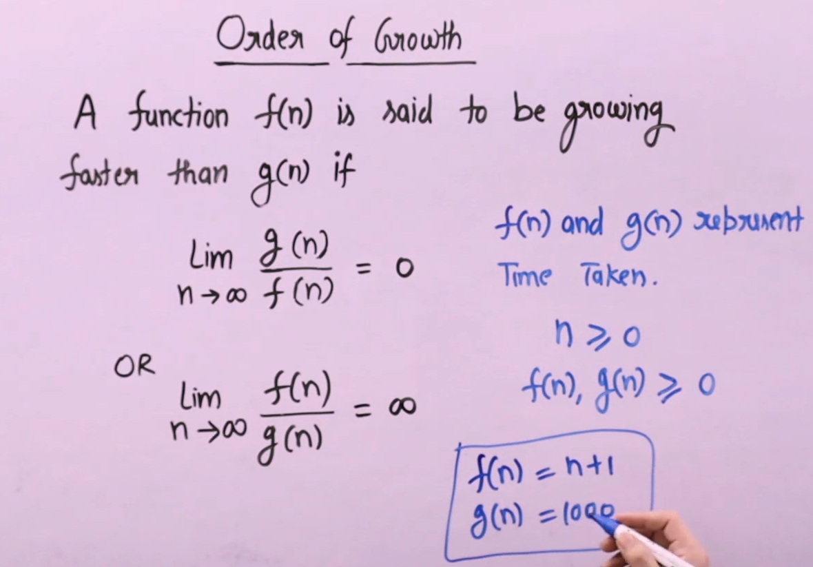
- **Some standard order of growths are**:  
  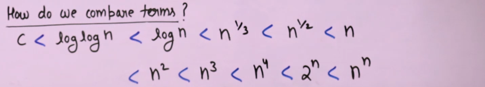

## Best, Worst and Average Case Analysis

- **Best Case Analysis**: It is the minimum time taken by the algorithm to solve the problem instance.** It is not a good measure** of the algorithm's performance as it is not possible to predict the best case for all inputs.
- **Worst Case Analysis**: It is the maximum time taken by the algorithm to solve the problem instance. **It is a good measure** of the algorithm's performance as it is possible to predict the worst case for all inputs.
- **Average Case Analysis**: It is the average time taken by the algorithm to solve the problem instance. **It is difficult to calculate** the average case time complexity as it depends on the distribution of inputs. For some alogirthms, we wishe to know the average case time complexity, for ex: insertion sort etc.

## Asymptotic Notations

Lets consider a linear search algorithm:
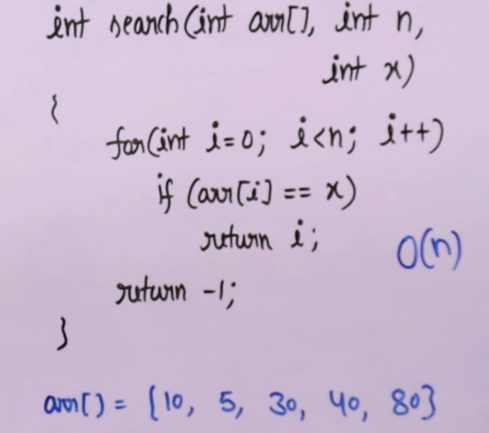

- **Big O Notation**: It gives the upper bound of the function. It is used to represent the worst case time complexity of an algorithm. It means that the **current algorithm is exact or lower than big O notation**.

- **Big Omega Notation**: It gives the lower bound of the function. It is used to represent the best case time complexity of an algorithm. It means that the **current algorithm is exact or higher than big Omega notation**.

- **Big Theta Notation**: It gives the tight bound of the function. It means that the **current algorithm is exact to big Theta notation**.

The above linear search algorithm has time complexity of O(n). It can nerver exceed the order of N, but it cam be < n.

## Big O Notation

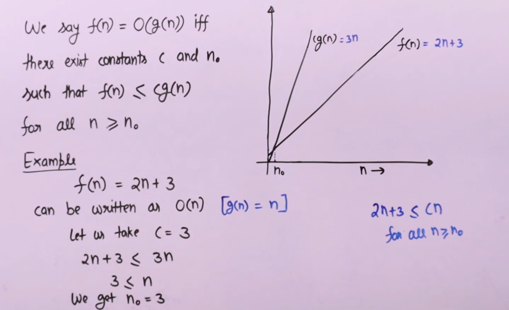

- We can igonore the lower order terms and constant factors/coefficents.
- Examples:
  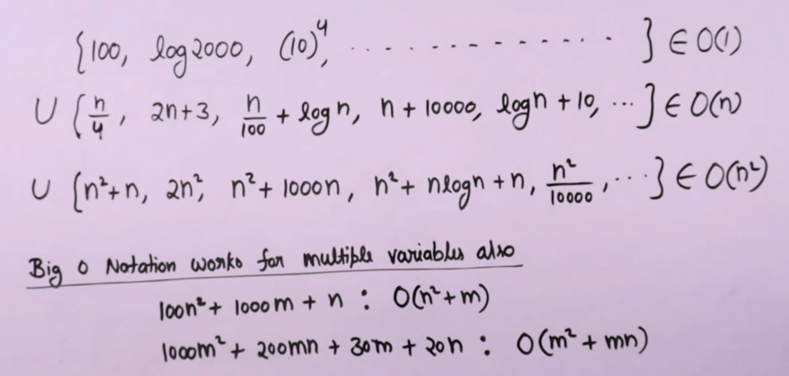
- We find this for complex algorithms where we cannot find exact time complexity. We can always manage to find an upper bound.
- Consider the prime number algorithm example:
  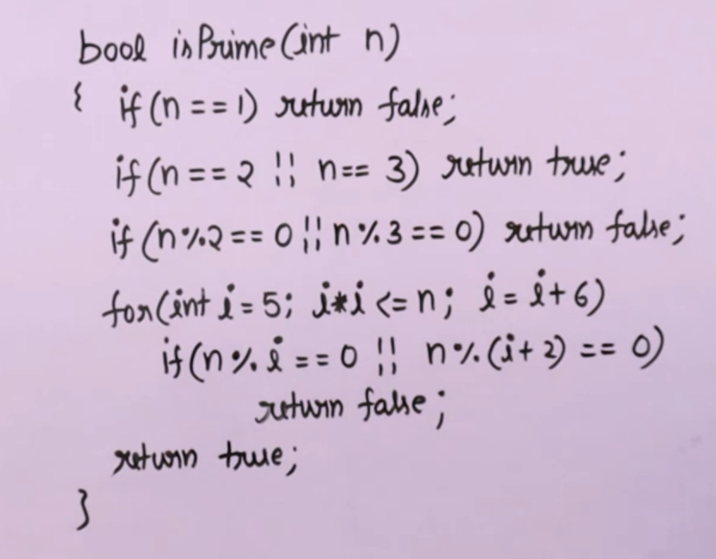
- The algorithm run till sqrt(n) when n is square of a prime, but it can be lower than sqrt(n) when n is not square of a prime. So, the time complexity is O(sqrt(n)).

## Omega Notation

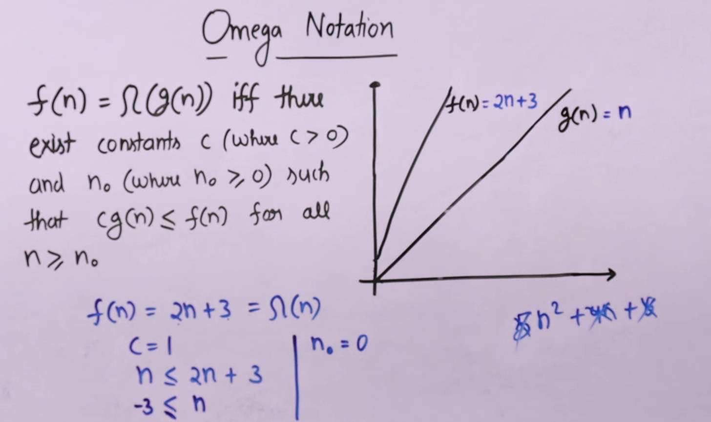

## Theta Notation

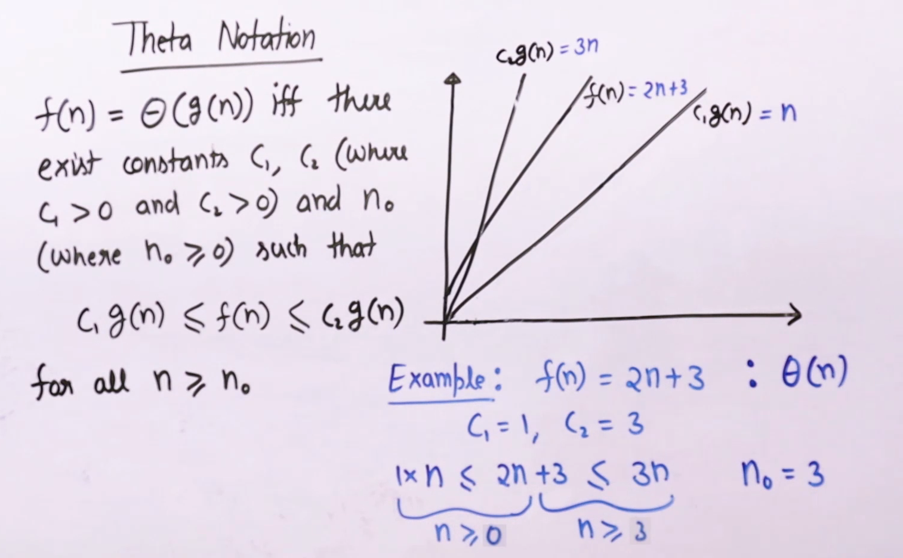

## Analysis of common loops

### Example 1:

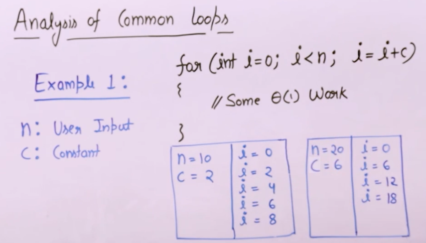

- Lets assume the loop runs k times. It starts from 0, C, C+C (2C), C+C+C (3C), ... kC
- Kc < n => k < n/c => Theta(n) Ignoring constants.

- Similarly, for this:
- 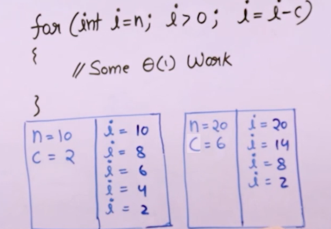

### Example 2:

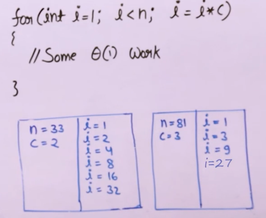

- It starts from 1, C*C, C*C\*C, ... C^(K-1) terms
- C^k-1 < n => k < log(n)+1 => Theta(log(n))
- Similarly, for this:
- 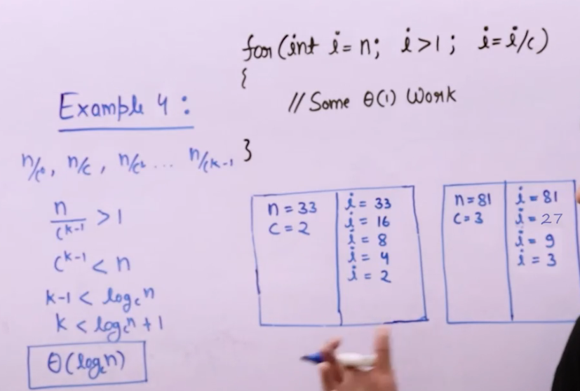

### Example 3:

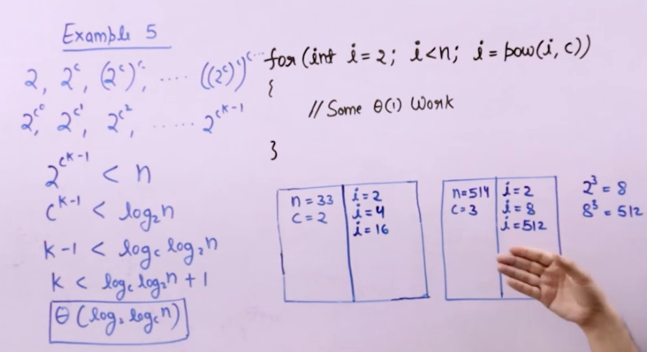

## Analysis of Multiple loops

- 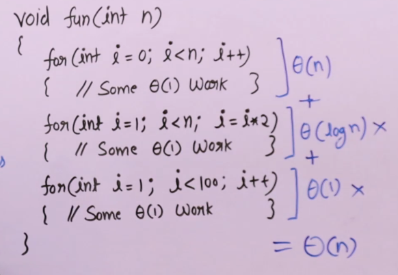
- 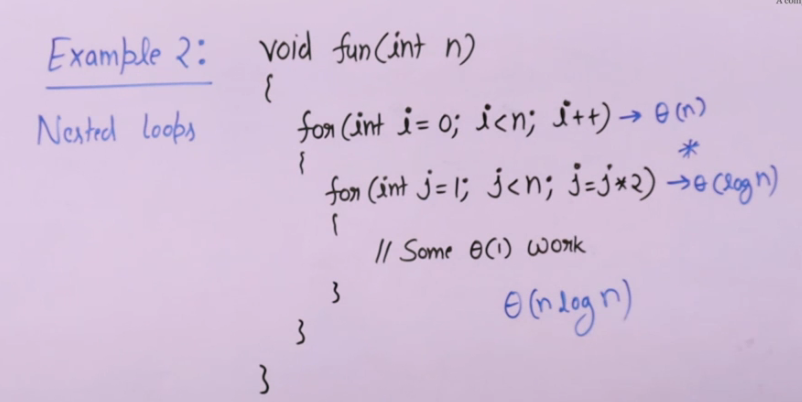
- 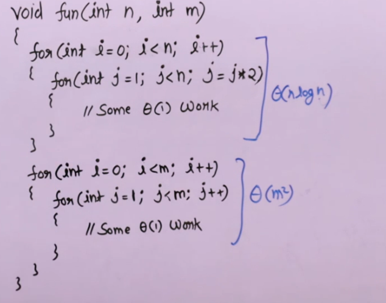

## Analysis of Recursions

### Writing Recurrence Relations

**Recurrence Relation**: It is an equation that recursively defines a sequence where a function appears on one side of the equation.  
 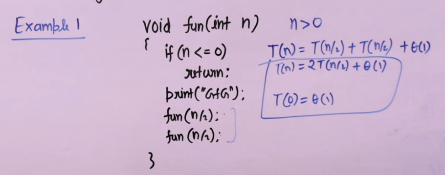

- Lets say T(n) is the time taken by the algorithm to solve the problem of size n. We can write the recurrence relation for the algorithm and a base case T(0) = 1.

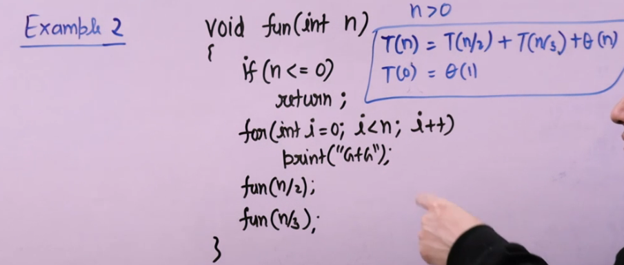

### Recursion Tree Method

- After writing the recurrence relation, we can solve it using recursion tree method where we draw the work done in terms of a tree and then sum the work done at each level of the tree to get the total work done by the algorithm. We are required to calculate the height of the tree to compute the total work done.  
  For example, lets consider the following recurrence relation:
  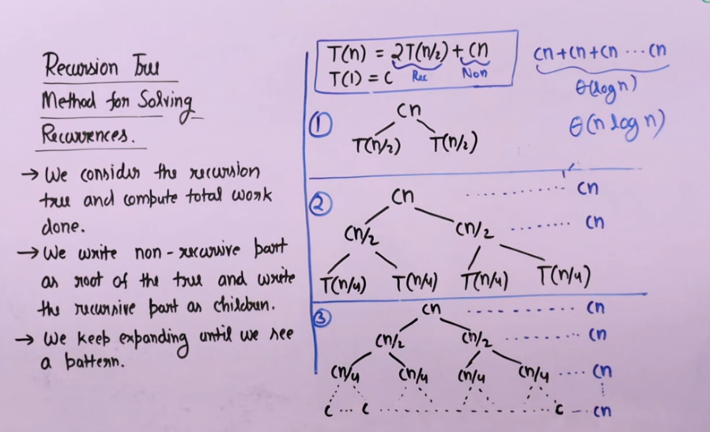
  - At each level, cn work is done and the height of the tree is log(n) as n is divided by 2 at each level.
  - So, the total work done is cn\*log(n) = Theta(nlog(n))

### More Examples

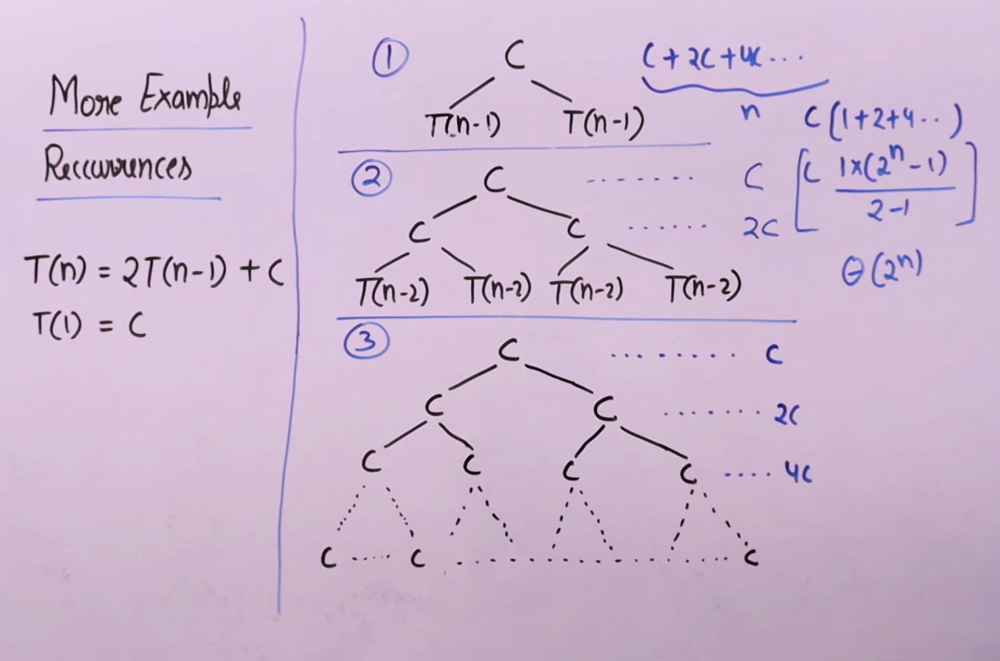

- The work done at levels is c + 2c + 4c + ...
- This a Geometri Progression with a = 1, r = 2, N=?
- Lets say no.of levels = k, the tree will reduce from n, n-1, n-2, ... n-k, where **n-k = 1** => k = n, hece n levels. **N=n**
- Formula for sum of n terms of GP is a(r^n-1)/(r-1)
- So, the total work done is (2^n-1)/(2-1) = 2^n-1 = **Theta(2^n)**

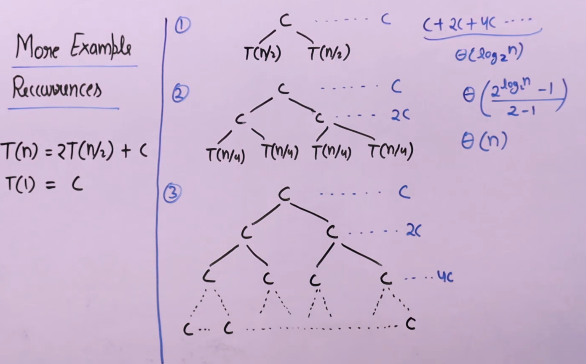

- The work done at levels is c + 2c + 4c + ...
- This a Geometri Progression with a = 1, r = 2, N=?
- Lets say no.of levels = k, the tree will reduce from n, n/2, n/4, ... n/2^k, where **n/2^k = 1** => k = log(n), hece log(n) levels, **N=log(n)**
- So, the total work done is (2^log(n)-1)/(2-1) = c(n-1) = **Theta(n)**

All of there are exact bound we are able to compute. Because we can see terms in the relation are varying at the same rate.

### Upper bounds in recursion tree method

- When we have varying terms in the relation, we can only find the upper bound. The tree wont be balanced, hence we assume the tree to be balanced and find the upper bound.
  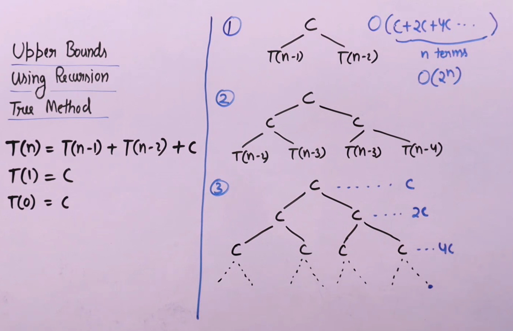
- In this case, the right part gets finised quickly as it lowering from n-2, when compared to left part which is lowering from n-1. Hence, the tree is not balanced.
- So, we assume the tree to be balanced and it has N=n levels and compute total work done as (2^n-1)/(2-1) = 2^n-1 = **Big O(2^n)**

## Space Complexity

- **Space complexity** is the amount of **memory space** required by the algorithm in its life cycle. It **includes the space required by the input**, output, auxiliary space, space required by the stack and heap memory.
- Auxiliary space is the extra space or temporary space used by the algorithm during its execution excluding the input space.
- In DSA, we mainly focus on the auxiliary space used by the algorithm.
- For recursions, **the height of the recursion** tree is the space complexity of the algorithm. Even if thr recursion doesnt directly use arrays or other spaces, it used space internally in the function call stack.
- The Auxiliary space for a recursive algorithm is the max no.of function call stacks at any point of time.
- In this fibbonaci example, the space complexity is O(n) as the height of the recursion tree is n.
  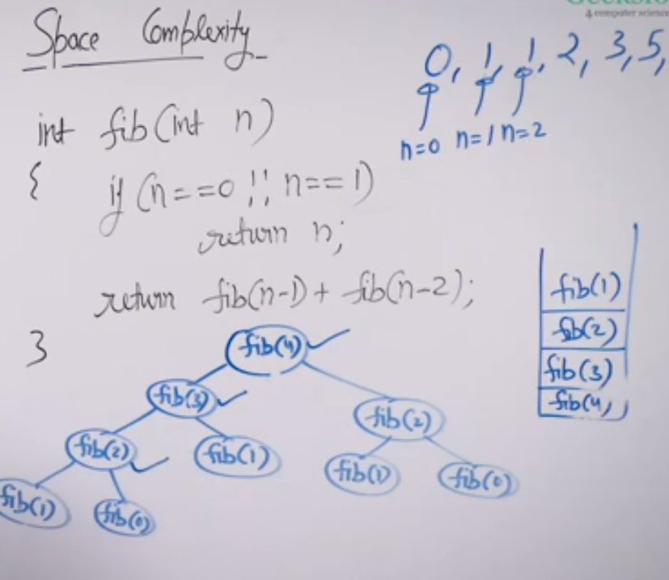
