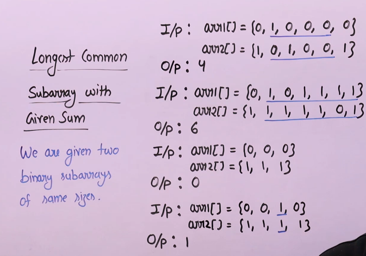
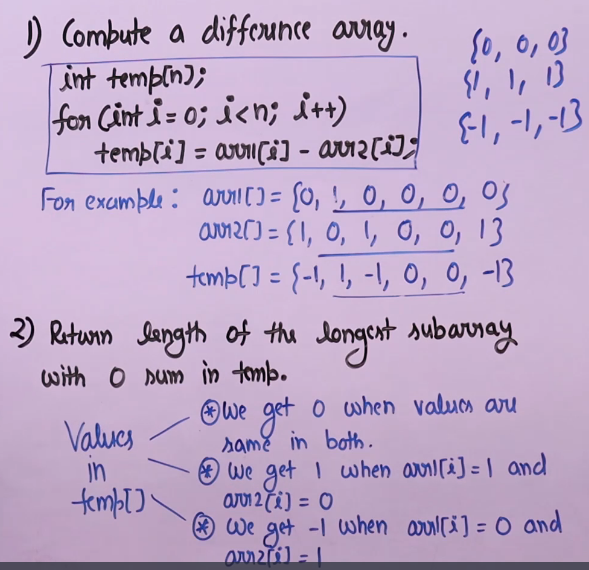

# Longest Common Subarray with equal sum 

## Problem Statement 

Find the longest common subarray length such their sums are equal in two binary arrays
 - Common subarrays means they start start at same indexand end at same index
  
## Intuition 
- If we could beak this down to the problem of longest subarray with given sum 

## Algorithm

- Compute a temp array with bit-wise difference 
- Now, the problem reduced to finding the longest subarray with sum zero in the temp array.