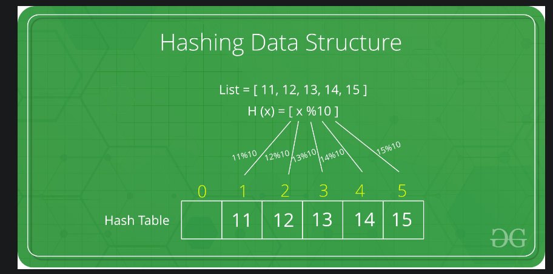
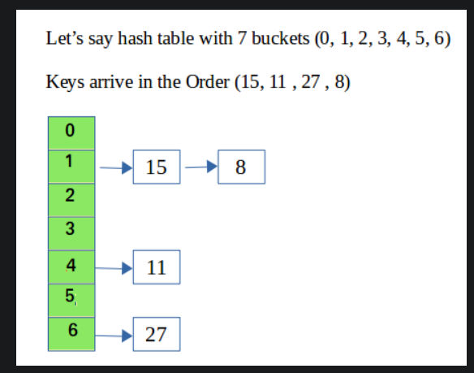
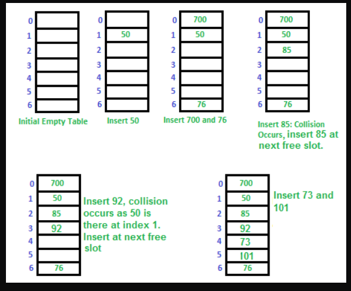
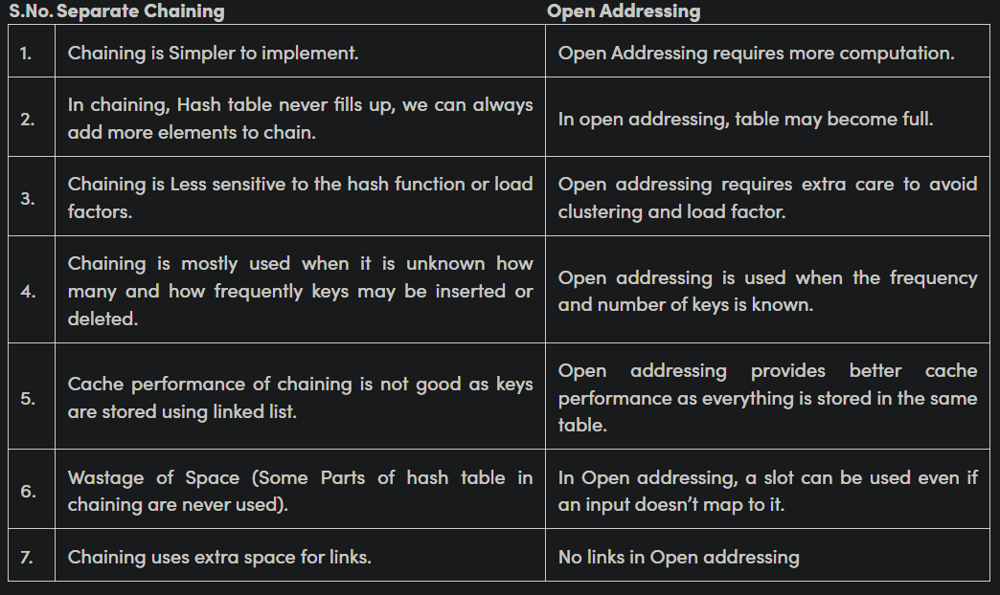

# Hashing Concepts 
- [Hashing Concepts](#hashing-concepts)
  - [Hashing Introduction](#hashing-introduction)
    - [Direct Address Table](#direct-address-table)
    - [Hash Functions](#hash-functions)
    - [Handling collisions](#handling-collisions)
  - [Chaining](#chaining)
  - [Open Addressing](#open-addressing)
    - [Linear Probing](#linear-probing)
    - [Quadratic Probing](#quadratic-probing)
    - [Double Hashing](#double-hashing)
  - [Chaining vs Open Addressing](#chaining-vs-open-addressing)
  - [Python Set internal working](#python-set-internal-working)

## Hashing Introduction
- Hashing datastructures are one of the most widely used in cs 
- It has insert,search,delete in O(1) time on average.
- There are many applications like DB Indexing, Caching, Cryptography etc.

### Direct Address Table 
- It is the way of using arrays for indexing.
- We can use array inddexing to store an element at an index=element so that insert,search,,delete becomes O(1)
- But, it is feasible due to
   - Large keys imply large array storage 
   - Index wont support floating values 

### Hash Functions

- Idea is to use a hash function to shrink the large key in to a value in [0,m] where m is the required hash table size. Then use direct adress table
- The main problem is too many hash collisions in case of poor hash function. (two numbers divisors of m will have same hash value)
- Modulo hash functions are only used in academic explanations. 

### Handling collisions
- There is birthday paradox which says if there are 23 people in a room
- The **birthday paradox**, also known as the birthday problem, is a probability puzzle that asks how many people need to be in a room before there is a greater than 50% chance that at least two of them share the same birthday.
- The answer may surprise you - it only takes 23 people in a room for there to be a greater than 50% chance of two people sharing the same birthday!
- So, hashing collisions are extremely serious challenges to be handled. 
- Two methods of hash collisions, chaining and open addressing

## Chaining 

- We store the collisions in a data structure like linked list 
- Load factor alpha = n/m , n: No.of keys m:No.of slots in hash table.
- So, expected chain length is alpha (assuming uniform distribution)
- Expected time to search,insert,delete is `O(1+alpha)`
- Both linkedlist and dynamic arrays give O(L) time for these opeartions where L is chain length. LL is not cache friendly 
- Red Black trees/AVL trees give **O(logL)** but are not cache friendly

## Open Addressing 
- Idea is to put the collision in another slot in the same hash table
- Important Operations:
  - Insert(k): Keep probing until an empty slot is found. Once an empty slot is found, insert k.
  - Search(k): Keep probing until the slot's key doesn't become equal to k or an empty slot is reached.
  - Delete(k): Delete operation is interesting. If we simply delete a key, then the search may fail. So slots of the deleted keys are marked specially as "deleted".

### Linear Probing

- In linear probing, we linearly probe for the next slot
- If slot hash(x) % S is full, then we try (hash(x) + i) % S where i is current index
- **Clustering:** The main problem with linear probing is clustering, many consecutive elements form groups and it starts taking time to find a free slot or to search an element.

### Quadratic Probing 
- We look for i2'th slot in i'th iteration.
- let hash(x) be the slot index computed using hash function. If slot hash(x) % S is full, then we try (hash(x) + 1*1) % S If (hash(x) + 1*1) % S is also full, then we try (hash(x) + 2*2) % S If (hash(x) + 2*2) % S is also full, then we try (hash(x) + 3*3) % S
- Secondary clustering but while searching we miss empty slots

### Double Hashing 
- We use another hash function hash2(x) and look for i*hash2(x) slot in i'th rotation.
- let hash(x) be the slot index computed using hash function. If slot hash(x) % S is full, then we try (hash(x) + 1*hash2(x)) % S If (hash(x) + 1*hash2(x)) % S is also full, then we try (hash(x) + 2*hash2(x)) % S If (hash(x) + 2*hash2(x)) % S is also full, then we try (hash(x) + 3*hash2(x)) % S
- Double hashing has poor cache performance but no clustering. Double hashing requires more computation time as two hash functions need to be computed.

## Chaining vs Open Addressing 

## Python Set internal working 
- Python's built-in set uses chaining to resolve collisions when hashing elements. 

- When a new set is created in Python, the interpreter allocates memory to hold the set's data and initializes a hash table with a fixed number of empty slots. 
- The number of slots in the hash table is determined based on the initial size of the set and the load factor, which is the ratio of the number of elements in the set to the number of slots in the hash table.
- When a set is modified by adding or removing elements, the interpreter may need to resize the hash table if the load factor exceeds a certain threshold. This involves allocating a new hash table with a larger number of slots, rehashing all the existing elements, and inserting them into the new table in their new positions.
- Overall, sets in Python provide efficient, O(1) average-case performance for common operations such as adding, removing, and checking for membership

