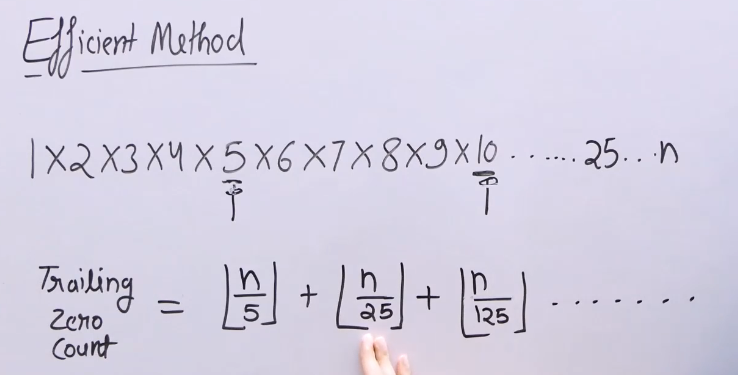

# Trailing Zeroes in a factorial

- [Trailing Zeroes in a factorial](#trailing-zeroes-in-a-factorial)
  - [Problem Statement](#problem-statement)
  - [Naive Approach](#naive-approach)
  - [Efficient Approach](#efficient-approach)
    - [Idea](#idea)
    - [Algorithm](#algorithm)
    - [Code](#code)

## Problem Statement

Given an integer `n`, return the number of trailing zeroes in `n!`.

Example:

```
Input: 5
Output: 1
Explanation: 5! = 120, one trailing zero.

Input: 10
Output: 2
Explanation: 10! = 3628800, two trailing zeroes.
```

## Naive Approach

- We can calculate the factorial of `n` and then count the number of trailing zeroes by dividing the factorial by 10 until the remainder is not 0.
- The time complexity of this approach is `O(n)`. But this approach is not efficient for large values of `n` because the factorial of large numbers can be very large and may not fit in the memory.

## Efficient Approach



### Idea

- If we consider prime factors of the facctorial value, then the pairs of 2 and 5 will give a trailing zero.
- Since there are more 2's than 5's in the factorial value, we can count the number of 5's in the factorial value to get the number of trailing zeroes.
- Multiples of 5 will have one 5, multiples of 25 will have two 5's, multiples of 125 will have three 5's, and so on.

### Algorithm

- Use the formula `n/5 + n/25 + n/125 + ...` to count the number of 5's in the factorial value.
- 125 multipe will have 3 5's, but the n/5, n/25 will already count the 5's in 125, so we need to add n/125 to the account for the third 5.

### Code

```python

'''
Time: O(logn), Space: O(1)
'''

def trailingZeroes(n: int) -> int:
    count =0
    i =5
    while i<=n:
        count = count + n // i
        i = i*5
    return count
```
