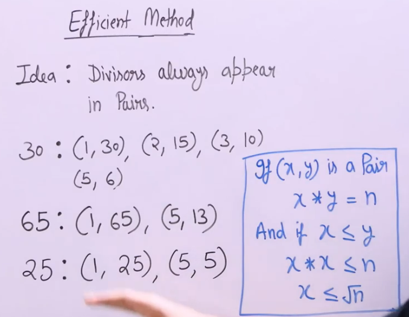

# Check If Prime

- [Check If Prime](#check-if-prime)
  - [Problem Statement](#problem-statement)
  - [Idea](#idea)
  - [Algorithm](#algorithm)
  - [Code](#code)

## Problem Statement

Given a number `n`, check if it is a prime number or not. A prime number is a number that is greater than 1 and has no divisors other than 1 and itself.

Examples:  
Input: n = 5  
Output: True

Input: n = 11  
Output: true

## Idea



- Divisors of a number always appear in pairs. If a number `n` has a divisor `d`, then `n/d` is also a divisor of `n`.
- In this way, we can access all divisors of a number by iterating from 1 to `sqrt(n)`.

## Algorithm

1. If `n` is less than 2, return False.
2. Iterate from 2 to `sqrt(n)`:
   - If `n` is divisible by `i`, return False.
   - If no divisor is found, return True.

## Code

```python
'''
Time: O(sqrt(n))
'''
import math
def is_prime(n):
    if (n==1):
        return False

    for i in range(2,math.sqrt(n)+1):
        if n%i==0:
            return False
    return True

```
