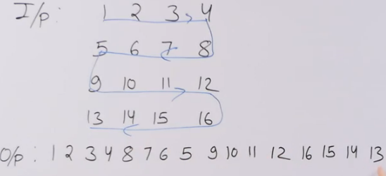

# Snake Pattern 
- [Snake Pattern](#snake-pattern)
  - [Problem Statement](#problem-statement)
  - [Code](#code)

## Problem Statement

Traverse the matrix in snake pattern

## Code
```python
R = 4
C = 4

def print_snake(mat):
    for i in range(R):
        if i % 2 == 0:
            for j in range(C):
                print(mat[i][j], end=" ")
        else:
            for j in range(C-1, -1, -1):
                print(mat[i][j], end=" ")

mat = [[1, 2, 3, 4],
       [5, 6, 7, 8],
       [9, 10, 11, 12],
       [13, 14, 15, 16]]

print_snake(mat)

```