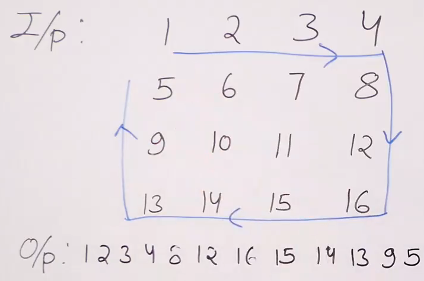

# Boundary Box Pattern 
- [Boundary Box Pattern](#boundary-box-pattern)
  - [Problem Statement](#problem-statement)
  - [Algprithm](#algprithm)
  - [Code](#code)

## Problem Statement 

Print the array in the bounding box pattern

## Algprithm
- Print 1st row, then last col, then last row, then first col
- Handle edge cases when c=1 or r=1

## Code 
```python

def boundary_pattern(mat,r,c):
    
    if r==1:
        for i in range(c):
            print(mat[0][i],end=" ")
            
    elif c==1:
        for i in range(r):
            print(mat[i][0],end=" ")
            
    else:
        for i in range(c):  # 1st row
            print(mat[0][i],end=" ")
        for i in range(1,r):   # last col
            print(mat[i][c-1],end=" ")
        for i in range(c-2,-1,-1):  # last row
            print(mat[r-1][i],end=" ")
        for i in range(r-2,0,-1):  # 1st col
            print(mat[i][0],end=" ")
```