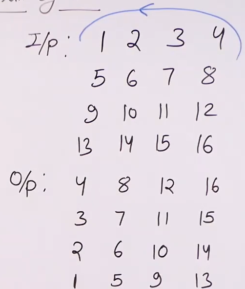

# Rotate the matrix by 90 left
- [Rotate the matrix by 90 left](#rotate-the-matrix-by-90-left)
  - [Problem Statement](#problem-statement)
  - [Algorithm](#algorithm)
  - [Code](#code)

## Problem Statement

Rotate the square matrix by 90 left inplace.

## Algorithm
- Transpose the matrix
- Swap first row last row, in this order 

## Code 
```python
'''
Time: O(N^2)
Space: 1
'''

   def rotateby90(self,mat, n): 
        # code here
        
        for i in range(n):   # Transpose the matrix
            for j in range(i+1,n):
                mat[i][j],mat[j][i]=mat[j][i],mat[i][j]
                
        low,high=0,n-1
        
        while low<high:   # for each first and last row

            for i in range(n):  # for each col in a row
                mat[low][i],mat[high][i]=mat[high][i],mat[low][i]
            low+=1
            high-=1
```