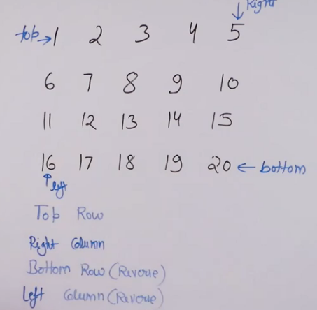

# Spiral Form 
- [Spiral Form](#spiral-form)
  - [Problem Statement](#problem-statement)
  - [Algorithm](#algorithm)
  - [Code](#code)
  - [Illustration](#illustration)

## Problem Statement 

Traverse the given matrix in a spiral fashion 

## Algorithm 

- maintain four pointers around the four corners of the matrix 
- Adjust these pointers, and print them in the spiral form
  - 1st print top row from left to right cols, then right col from top to bottom, then bottom row from right to left cols, then left col from bottom to top rows

## Code 
```python

   def spirally_traverse(self,mat, r, c): 
        # code here 
        res=[]
        top,right,bottom,left=0,c-1,r-1,0
        
        while left<=right and top<=bottom:
            
            for i in range(left,right+1):
                res.append(mat[top][i])
            top+=1
            
            for i in range(top,bottom+1):
                res.append(mat[i][right])
            right-=1
            
            if top<=bottom:   # to ensure repeated rows are not printed
                for i in range(right,left-1,-1):
                    res.append(mat[bottom][i])
                bottom-=1
            
            if left<=right:  # to ensure repeated cols are not printed
                for i in range(bottom,top-1,-1):
                    res.append(mat[i][left])
                left+=1
                
        return res
```

## Illustration 


