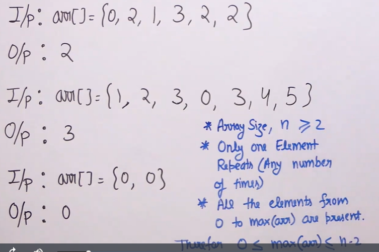
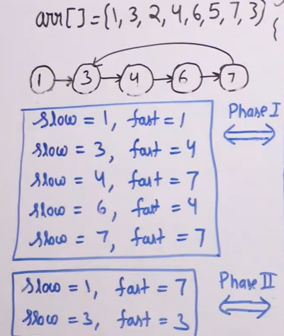
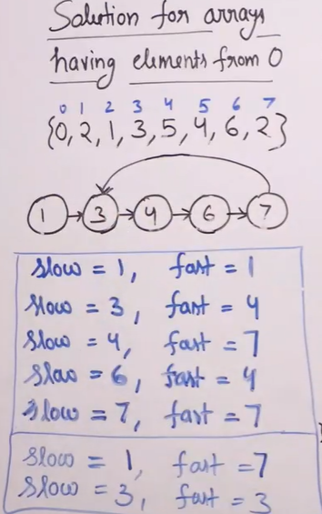

# Repeating Element
- [Repeating Element](#repeating-element)
  - [Problem Statement](#problem-statement)
  - [Intuition](#intuition)
  - [Algorithm](#algorithm)
  - [Code](#code)
  - [Illustration](#illustration)

## Problem Statement
Find the only repeating in an array of integer.


## Intuition
- Since there is a repeating element, two or more indices should definitely point to this repeating element in the array.
- If we can think of each element as a node in the Linked List and each node values is like address of next node (points to next node) in form of arr[node_value].
- Now, the prblems is reduced to cycle detection in a virtual Linked List 
  
## Algorithm
- Consider the virtual Linked List as explained above.
- Apply floydd detection algorithm to detect the cycle entrace. This is the repeating element
- Since array can contain zero, there can be chances when both value and its corresponding index are equal. This forms unnecessary loops
- To avoid this, cosider as if  all indices are incremented to 1. So perform opeartions by adding 1 and return final answer by subtracting 1. (If all elements >=1 , no need of this) 

## Code 

```python

   class GFG:

    @staticmethod
    def repeat(arr, n):

        slow = arr[0] + 1
        fast = arr[0] + 1

        while True:              # This is do while in Java. we have to usw while loop here. Sice slow and fast are equal at beginning
            slow = arr[slow] + 1
            fast = arr[arr[fast] + 1] + 1

            if slow == fast:
                break

        slow = arr[0] + 1

        while slow != fast:
            slow = arr[slow] + 1
            fast = arr[fast] + 1

        return slow - 1

```

## Illustration
With out zero in array



With zero in array

