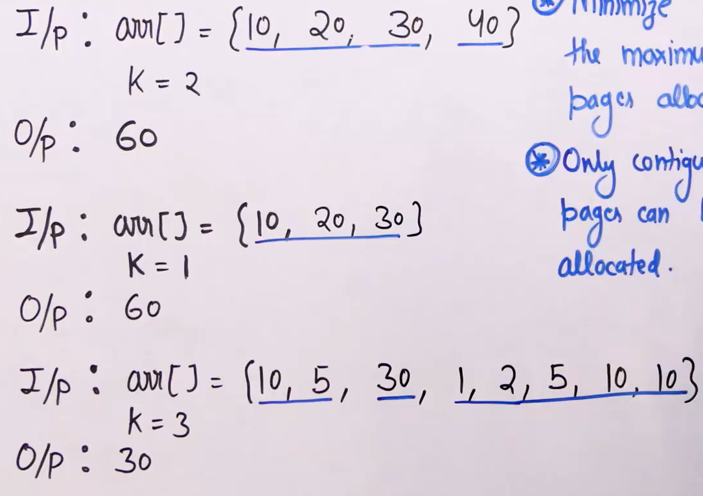
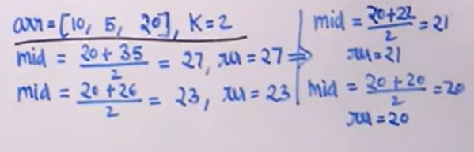

# Allocate Pages to Students

- [Allocate Pages to Students](#allocate-pages-to-students)
  - [Problem Statement](#problem-statement)
  - [Intuition:](#intuition)
  - [Algorithm](#algorithm)
  - [Illustration](#illustration)
  - [Code](#code)

## Problem Statement


**Given a array indiccating no.of pages og each book and integer k= no.of students. Task it to minimize the maximum pages a student gets when pages are allocated.**  
Conditions:

- Every page should be allocated (a student can get zero books)
- Allocation of books happen in contiguous way. (students can read a book only if he can read previous book aw well.)

## Intuition:

- If we can discover the fact that final answer should be <= total sum and >= max pages in the array.
- In the fist test case, answer lies in [30,100] because any one student should get atleast 30 pages and a student can get all the pages (100)
- The problem can be reduced to search for the actual answer in the sorted range using binary search
- Think the condition on how to search and move the mid.

## Algorithm

- Compute the range of the final answer
- Use binary search on this range
  - check if mid can be a feasible solution. If yes, search in left half
  - Else, move to right half
- Mid is feasible when
  - Calculate how many students it takes to allocate the pages such that max pages a student gets is <= mid
  - If students required <= k, it is feasible.

## Illustration



## Code

```python
'''
     Time: O(Nlog(SUM))
     Space: 1
'''

def is_feasible(arr, n, k, ans):
    req = 1
    sum = 0
    for i in range(n):    # counting no.of students required
        if arr[i] > ans:
            return False
        if sum + arr[i] > ans:
            req += 1
            sum = arr[i]
        else:
            sum += arr[i]
    return req <= k

def min_pages(arr, n, k):
    sum = 0
    mx = 0
    for i in range(n):
        sum += arr[i]
        mx = max(mx, arr[i])
    low = mx
    high = sum
    res = 0

    while low <= high:    # applying binary search on the range
        mid = (low + high) // 2
        if is_feasible(arr, n, k, mid):
            res = mid
            high = mid - 1
        else:
            low = mid + 1

    return res

arr = [10, 20, 10, 30]
n = len(arr)
k = 2
print(min_pages(arr, n, k))

```
