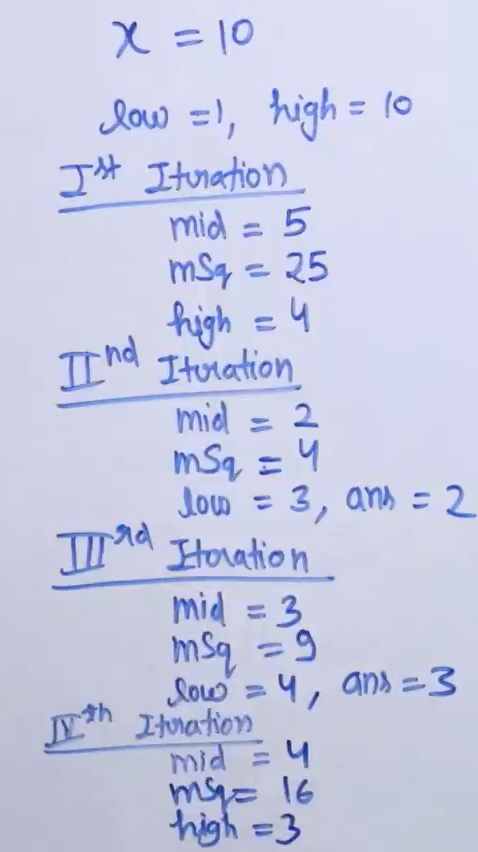

# Square Root of a Number

## Problem Statement

**Given an integer X, find its square root. If X is not a perfect square, then return floor(√x).**

Examples : 

Input: x = 4
Output: 2  
Explanation: The square root of 4 is 2.

Input: x = 11
Output: 3  
Explanation:  The square root of 11 lies in between 3 and 4 so floor of the square root is 3.

## Algorithm
- Use binary search on assuming an array of integers from 1 to X
- search for maximum mid such that arr[mid]^2 <= x and return that mid

## Code

```python
'''
'''
   def square_root(x):
      low = 1
      high = x

      while low <= high:

        mid = (low + high)//2
        mid_square = mid * mid

        if mid_square > x:
            high = mid-1   # Find a lower number than mid
       
        elif mid_square == x:
            return mid

        else:
            low = mid+1  # Step 2 in Algorithm
            res = mid
```

## Illustration 



