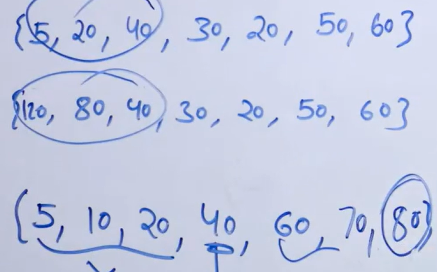

# Find Peak Element in an unsorted array
- [Find Peak Element in an unsorted array](#find-peak-element-in-an-unsorted-array)
  - [Problem Statement](#problem-statement)
  - [Intuition](#intuition)
  - [Algorithm](#algorithm)
  - [Illustration](#illustration)
  - [Code](#code)

## Problem Statement
**Given an array arr[] of integers. Find a peak element i.e. an element that is not smaller than its neighbors.**

Note: For corner elements, we need to consider only one neighbor. 

Example:

Input: array[]= {5, 10, 20, 15}  
Output: 20  
Explanation: The element 20 has neighbors 10 and 15, both of them are less than 20.

Input: array[] = {10, 20, 15, 2, 23, 90, 67}  
Output: 20 or 90  
Explanation: The element 20 has neighbors 10 and 15, both of them are less than 20, similarly 90 has neighbors 23 and 67.

## Intuition
- We use binary search on this unsorted array based on an observational fact 
- That is, we mid is not peak element 
   - If left neighbor is greater, then left half must contain a peak element and vice-versa 
  
## Algorithm
- If mid is not peak
   - If left neighbor > mid, move to left half : high = mid-1
   - Else, move to right half : low = mid+1
  
## Illustration

- First two arrays, 40 >30, so its showing left half must has a peak in any arrangement of elements in left half.
- Last array show, 60>40, so right half must have a peak in any arrangement of elements in right half
- Note 20<40 doest mean left shouldnt have a peak, it justifies right half.
  
## Code
```python
'''
  Time: O(logN)
  Space: O(1)
'''

   def getPeak(arr, n):
    low = 0
    high = n - 1
    
    while low <= high:
        mid = (low + high) // 2
        
        if (mid == 0 or arr[mid - 1] <= arr[mid]) and (mid == n - 1 or a[mid + 1] <= arr[mid]):
            return mid
        
        if mid > 0 and arr[mid - 1] >= arr[mid]:   ## checking if there are values in left and if left should contain peak value
            high = mid - 1
        else:
            low = mid + 1
            
    return -1
    
```