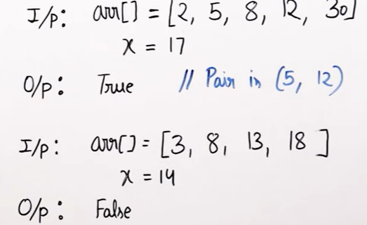
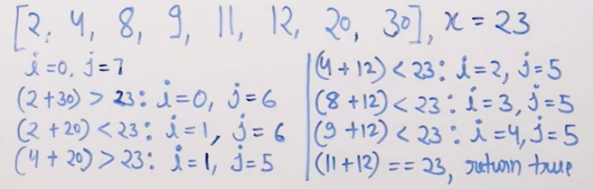

# Two Pointer Approach 

## Problem Statement
**Find if there is a pair with sum x in a sorted array.**


## Algorithm
- maintain left, right pointers
- if left+right <x : left++
- else if left+right > x: right--
- else if left+right =x : return true
- left>= right : return false
  
## Code

```python

'''
  Time: O(N)
  Space: 1
'''
   
   def pairSum(arr,N,x):

    left , right = 0,N-1

    while left < right:
         
         sum = left + right
         if sum == x: return True
         if sum >x:
            right-=1
         else:
            left+=1
    
    return False

```
## Illustration

- 2 + 30 > 23
   - i.e we can safely discard 30, since 30 with 4,8,9,11,..(other than 2) will always give > 23
- 2+20 < 23
   - i.e we can safely discard 2, since 2 with 4,8,9,11,..(other than 20) will always give < than 23