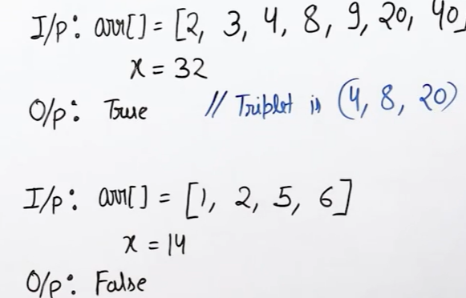

# Triplet in sorted array
- [Triplet in sorted array](#triplet-in-sorted-array)
  - [Problem Statement](#problem-statement)
  - [Intuition](#intuition)
  - [Algorithm](#algorithm)
  - [Code](#code)


## Problem Statement 
Find if there is a triplet with given sum in a sorted array


## Intuition
- It is similar to two pointer pair sum

## Algorithm
- For every element in the array, check if theres a pair in the next part of the array with the remaining sum.

## Code

```python
   
   '''
     Time: O(n^2)
     Space: 1
   '''
  def triplet_sum(arr,N,x):

    for i in range(n-2):
        target = x-arr[i]
        if pair_sum(arr,N,target,i+1):
            return True
    
    return False
```
Note: `This is the most efficient solution. It cannot be < O(n^2)`