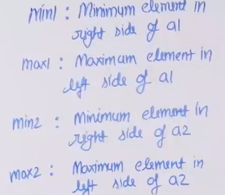
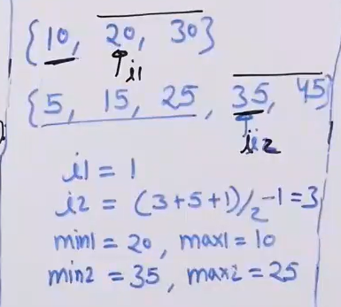

# Median of Two Sorted Arrays

- [Median of Two Sorted Arrays](#median-of-two-sorted-arrays)
  - [Problem Statement](#problem-statement)
  - [Intuition](#intuition)
  - [Algorithm](#algorithm)
  - [Code](#code)
  - [Illustration](#illustration)

## Problem Statement
**Given two sorted arrays, a[] and b[], the task is to find the median of these sorted arrays, where N is the number of elements in the first array, and M is the number of elements in the second array.** 

Examples: 

Input: a[] = {-5, 3, 6, 12, 15}, b[] = {-12, -10, -6, -3, 4, 10}  
Output: The median is 3.  
Explanation: The merged array is: ar3[] = {-12, -10, -6, -5 , -3, 3, 4, 6, 10, 12, 15}.
So the median of the merged array is 3

Input: a[] = {2, 3, 5, 8}, b[] = {10, 12, 14, 16, 18, 20}  
Output: The median is 11.  
Explanation : The merged array is: ar3[] = {2, 3, 5, 8, 10, 12, 14, 16, 18, 20}  
If the number of the elements are even. So there are two middle elements.
Take the average between the two: (10 + 12) / 2 = 11.

## Intuition
- If we could combine the two arrays in to single array by merginh left halfs and right halfs and check median 
- Find index where this split and merger can happen using binary search
  
## Algorithm
- Find the indexs on both arrays such that left halfs combined and right halfs combined have same no.of elements or left halfs combined one extra element.
   - for i1 (mid of array) i2 = ((n1+n2+1)/2)-i1, we get this condition
- Find such index and make sure left and right halfs combined gives a sorted array. if not search for the index accordingly.
- Return the median of this virtual final sroted array based on length.


## Code 

```python

 '''
    Time: O(log(min(n1, n2)))
    Space: 1
 '''
  
   def getMed(a1, a2, n1, n2):
    begin1, end1 = 0, n1
    
    while begin1 <= end1:
        i1 = (begin1 + end1) // 2
        i2 = ((n1 + n2 + 1) // 2) - i1
        
        min1 = a1[i1] if i1 < n1 else float('inf')
        max1 = a1[i1-1] if i1 > 0 else float('-inf')
        min2 = a2[i2] if i2 < n2 else float('inf')
        max2 = a2[i2-1] if i2 > 0 else float('-inf')
        
        if max1 <= min2 and max2 <= min1:
            if (n1 + n2) % 2 == 0:
                return (max(max1, max2) + min(min1, min2)) / 2
            else:
                return max(max1, max2)
        elif max1 > min2:
            end1 = i1 - 1
        else:
            begin1 = i1 + 1
            
    return -1

a1 = [10, 20, 30, 40, 50]
n1 = 5
a2 = [5, 15, 25, 35, 45]
n2 = 5

print(getMed(a1, a2, n1, n2))

```
## Illustration


First iteration:



- 10<35 but 25>20, 
   - hence continue search
   - sice 20<25, we move forward in arr1, so begin = i1+1
   - else end = i1-1