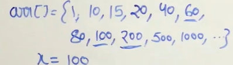

# Search in an Infinite Sorted Array
- [Search in an Infinite Sorted Array](#search-in-an-infinite-sorted-array)
  - [Problem Statement](#problem-statement)
  - [Algorithm](#algorithm)
  - [Illustration](#illustration)
  - [Code](#code)
  - [bisect\_left (Optional)](#bisect_left-optional)

## Problem Statement
**Given an infinite sorted array consisting unique numbers. The problem is to find the index of search value in that array. I f not there, return -1**

Examples:

Input : arr[] = {1,10,20,50,75,80,97,100,....} , x= 80
Output : 5

Input : arr[] = {12, 45,67,94,.....} , x- 48
Output : -1

## Algorithm
- Instead of traversing through each element of the array, we search the range where it can be found by doubling the index.
- Now, do binary search in this range where element can be found

## Illustration

- Here, 40 at index 4 (i/2) after that we reach to 200 (i) at index 8.
- The element must be in i/2+1 to i-1. Hence do binary search in this range

## Code 
```python
'''
 Time: O(logPOS)
 Space: 1
'''
import bisect

def search_infinite(arr,x):
    
    if arr[0] == x: return 0
    i = 1
    while(arr[i]<x):
        
        i *=2
        
    if arr[i] == x: return x
    
    left = i/2+1 
    right = i-1
    
    indx = bisect.bisect_left(arr,left,right+1)     # this function excludes high value
    
    if indx < right+1 and arr[indx] == x:   # To check if it actually found the taraget
        return indx
        
    else: return -1
```

## bisect_left (Optional)
- If the target value is not found in the specified range of the list, the bisect_left function returns the index where the target value could be inserted while maintaining the list's ordering.
- For example, if the target value is greater than all values in the specified range, the function will return the index of the first element outside the range (i.e., hi+1). 
- Similarly, if the target value is smaller than all values in the range, the function will return the index of the first element in the range (i.e., lo).
- To check if the target value was actually found, you can compare the value at the returned index to the target value. If the values are not equal, then the target was not found in the specified range.
