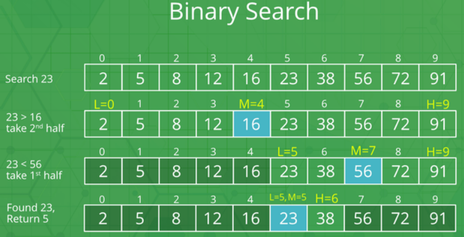
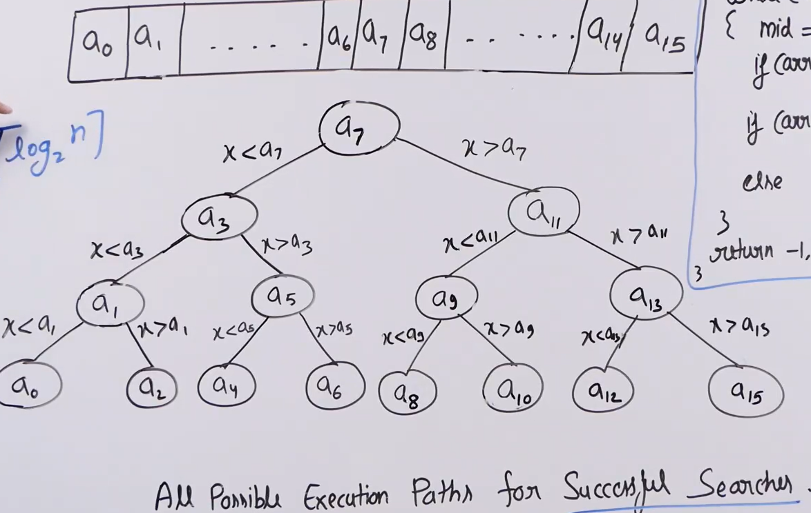

- [Binary Search](#binary-search)
  - [Binary Search Approach:](#binary-search-approach)
  - [Illustration](#illustration)
  - [Time Analysis](#time-analysis)
  - [Code:](#code)
    - [Iterative](#iterative)
    - [Recursive](#recursive)

# Binary Search
Problem: Given a sorted array arr[] of n elements, write a function to search a given element x in arr[] and return the index of x in the array.

**Examples:**

Input: arr[] = {10, 20, 30, 50, 60, 80, 110, 130, 140, 170}, x = 110  
Output: 6
Explanation: Element x is present at index 6. 

Input: arr[] = {10, 20, 30, 40, 60, 110, 120, 130, 170}, x = 175
Output: -1
Explanation: Element x is not present in arr[].

## Binary Search Approach:

Binary Search is a searching algorithm used in a sorted array by repeatedly dividing the search interval in half. The idea of binary search is to use the information that the array is sorted and reduce the time complexity to O(Log n). 

- Begin with the mid element of the whole array as a search key.
- If the value of the search key is equal to the item then return an index of the search key.
- Or if the value of the search key is less than the item in the middle of the interval, narrow the interval to the lower half.
- Otherwise, narrow it to the upper half.
- Repeatedly check from the second point until the value is found or the interval is empty.
  
## Illustration


## Time Analysis

- All the leaf nodes are possible search keys and it taked height of the tree iteration which is logN base 2

## Code:
### Iterative
```python
   '''Time: logn Space: 1'''

    def binary_search(self,arr, N, K):   
        low = 0
        high = N-1
        
        while low<= high:
            mid = (low+high)//2  # floor division
            
            if K < arr[mid]:
                high= mid-1
                
            elif K > arr[mid]:
                low = mid+1
            
            else:
                return 1
                
        return -1
```
### Recursive
```python
   ''' Time: O(logN)
       A.Space: O(logN) - due to function stack
   '''
   def binary_search(arr,k,low,high):

      if low > high:
        return -1
      
      mid = (low + high)//2

      if arr[mid] == k : return mid

      if arr[mid] < k:
        return binary_search(arr,k,mid+1,high)

      if arr[mid] > k:
        return binary_search(arr,k,low,mid-1)

```