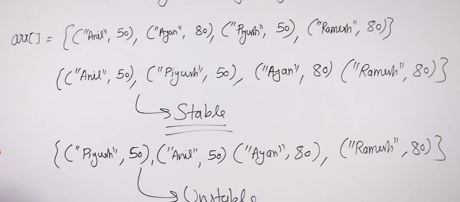

# Introduction 
- [Introduction](#introduction)
  - [General Purpose Algorithms](#general-purpose-algorithms)
  - [Hybrid Algorithms](#hybrid-algorithms)
  - [Stability in Sorting Algorithm](#stability-in-sorting-algorithm)
  - [Python Built-in Sort Functions](#python-built-in-sort-functions)
    - [sorted(iterable\[, key\]\[, reverse\]):](#sortediterable-key-reverse)
    - [list.sort(key=None, reverse=False):](#listsortkeynone-reversefalse)
    - [Internal Working](#internal-working)

`For a random array of values, it takes atleast NlogN comparsions to sort the array.`

## General Purpose Algorithms
- Merge Sort
   - **Stable** 
   - Can be applied to Linked list as well
   - Worst case Time: O(NlogN)
- Heap Sort
  - **Unstable**
  - Cannot be applied to Linked list as well
  - Worst case Time: O(NlogN)
- Quick Sort
  - **Unstable**
  - Can be applied to Linked list as well
  - Avergae : O(NlogN) Worst: O(N^2)
  - But works faster than above algos, in average case
  
## Hybrid Algorithms 
- Used in Libraries
- Timm Sort
   - Uses Merge Sort, when size decreases uses Insertion Sort
 - IntroSort
   - Uses QuickSort, when space increases uses Heap Sort, when size decreases uses Insertion sort

## Stability in Sorting Algorithm

- Stability is mainly essential when we have key-value pairs with duplicate keys possible (like people's names as keys and their details as values). And we wish to sort these objects by keys.
- A sorting algorithm is said to be **stable** if two objects with equal keys appear in the same order in sorted output as they appear in the input data set
- For **primitive values**, like integers, strings, floats, there is no need for stablility
- For sorting **objects** with >1 fields based on >=1 fields, we stability makes sense
- Stable Sorts
   - Bubble sort, Insertion Sort, Merge Sort,...
- Unstable Sorts
   - Selection Sort, Quick Sort, Heap Sort,...

## Python Built-in Sort Functions

### sorted(iterable[, key][, reverse]): 
- This function returns a new **sorted list** from the items in iterable. It takes an optional key function to customize the sort order, and an optional reverse parameter to sort in descending order. 
  
 ```python
    # Sort a list of integers
nums = [3, 1, 4, 1, 5, 9, 2, 6, 5, 3, 5]
sorted_nums = sorted(nums)
print(sorted_nums)
# Output: [1, 1, 2, 3, 3, 4, 5, 5, 5, 6, 9]

# Sort a list of tuples by the second item in each tuple
tuples = [(1, 'a'), (3, 'c'), (2, 'b'), (4, 'd')]
sorted_tuples = sorted(tuples, key=lambda x: x[1])
print(sorted_tuples)
# Output: [(1, 'a'), (2, 'b'), (3, 'c'), (4, 'd')]

# Sort a list of strings in reverse alphabetical order
words = ['apple', 'banana', 'cherry', 'date']
sorted_words = sorted(words, reverse=True)
print(sorted_words)
# Output: ['date', 'cherry', 'banana', 'apple']

 ```
 ### list.sort(key=None, reverse=False):
-  This method sorts the list in place. It takes the same optional key and reverse parameters as sorted().
- There is not tuple.sort()
```python
# Sort a list of integers in place
nums = [3, 1, 4, 1, 5, 9, 2, 6, 5, 3, 5]
nums.sort()
print(nums)
# Output: [1, 1, 2, 3, 3, 4, 5, 5, 5, 6, 9]

# Sort a list of tuples in place by the second item in each tuple
tuples = [(1, 'a'), (3, 'c'), (2, 'b'), (4, 'd')]
tuples.sort(key=lambda x: x[1])
print(tuples)
# Output: [(1, 'a'), (2, 'b'), (3, 'c'), (4, 'd')]

# Sort a list of strings in place in reverse alphabetical order
words = ['apple', 'banana', 'cherry', 'date']
words.sort(reverse=True)
print(words)
# Output: ['date', 'cherry', 'banana', 'apple']

```
### Internal Working
- The implementation of the sorted() function and the sort() method in Python use an algorithm called **Timsort**. Timsort is a stable, adaptive sorting algorithm
- Timsort is a hybrid sorting algorithm that combines elements of insertion sort and merge sort. It works by dividing the input into small subarrays, sorting them with insertion sort, and then merging the sorted subarrays using a modified merge sort algorithm.
- It has a worst-case time complexity of O(nlogn) and a best-case time complexity of O(n).
- Space: O(1) , best case: O(1)
  