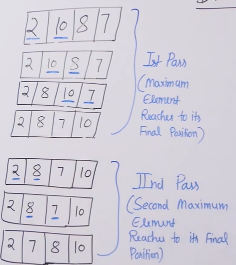
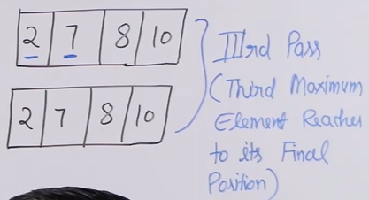

# Bubble Sort 
- [Bubble Sort](#bubble-sort)
  - [Algorithm](#algorithm)
  - [Illustration](#illustration)
  - [Code](#code)
  - [Optimized Code](#optimized-code)
  - [Complexities](#complexities)
    - [Time](#time)
    - [Space](#space)
    - [Stability](#stability)

## Algorithm 
1. The idea is to move 1st max element to right end and then 2nd max element to end and so on till the array is sorted.
2. For this, we keep on comparing two adjacent elements and swap them if they are out of order (prev>current)
3. Moving one element like this is called one pass
4. We end doing n-1 passes in total (since first element will be naturally in order after n-1 passes).

## Illustration




## Code 
```python
    def bubbleSort(self,arr, n):
        
        for i in range(0,n-1):   # for n-1 passes
            
            for j in range(0,n-1-i):  # since upto i elements are already sorted no need of checking them
                
                if (arr[j]>arr[j+1]):
                    arr[j],arr[j+1] = arr[j+1],arr[j]
                    
```

## Optimized Code
- When the array becomes sorted after a pass, we can identify it and simply stop the function. For this we check if for a pass, no element is swapped.

```python
  
     def bubbleSort(self,arr, n):
        
        
        for i in range(0,n-1):
            swapped = False
            for j in range(0,n-1-i):
                
                if (arr[j]>arr[j+1]):
                    arr[j],arr[j+1] = arr[j+1],arr[j]
                    swapped = True   # keep track if something swapped
                    
            if not swapped:   # already sorted, so no need to do anything else
                break
```
## Complexities
### Time
- Before optimizing, the TC is Theta(N^2), coz we definitely need N^2 iterations for every case
- After optimizing, the TC is O(N^2) i.e. worst case is O(N^2), but can be O(N) sometimes
### Space 
- Clearly O(1), its inplace sorting

### Stability
- The algo is stable, since we only swap when prev>current, if they are same we dont swap 