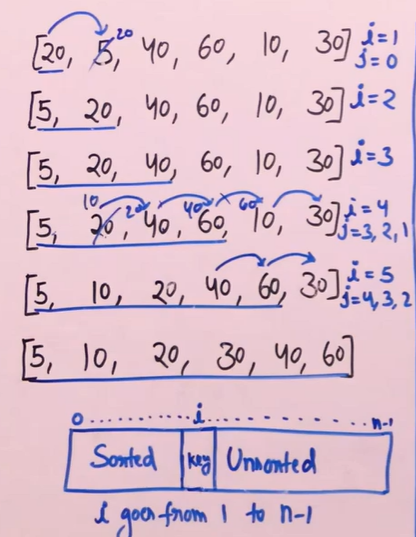

# Insertion Sort 
- [Insertion Sort](#insertion-sort)
  - [Algorithm](#algorithm)
  - [Illustration](#illustration)
  - [Code](#code)
  - [Complexity](#complexity)
  - [Stability](#stability)

## Algorithm 
- Idea is to iterate thriugh each element and insert that element in to upto now sorted array so that we can extend this sorted array.
- say current element is key, to insert it at the index
   - start from end of upto now sorted array, say from j
   - if arr[j]>key, it menas key should appear before, so arr[j] should go forward one space to extend the array -> arr[j+1]=arr[j]
 - Do this for every key from 2nd element in the given array
  

## Illustration 


## Code 
```python
    def insertionSort(self, arr, n):
        for i in range(1,n):
            key = arr[i]
            j = i-1
            while(j>=0 and arr[j]>key):
                arr[j+1] = arr[j]
                j-=1
            arr[j+1] = key
```

## Complexity
- Time: O(N^2) in worst case when array is reverse sorted, O(N) in best case when array is sorted
- Space: O(1), inplace sorting 
  
## Stability
- It is stable,sice we use arr[j]>key, if we use >= it will become unstable
- Usually preferred for small arrays and hybrid algorithms use this sort when array becomes small.