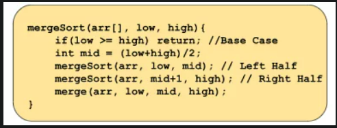
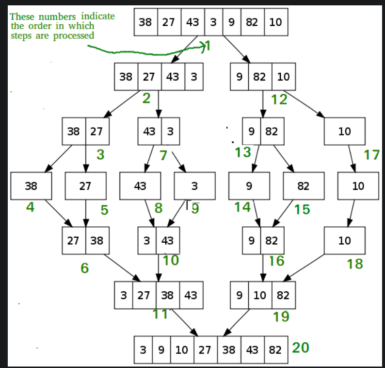
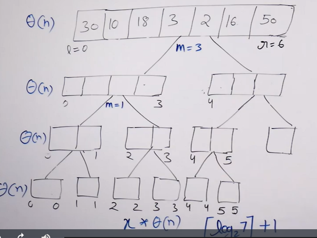

# Merge Sort 
- [Merge Sort](#merge-sort)
  - [Intuition](#intuition)
  - [Algorithm](#algorithm)
    - [Pseudocode](#pseudocode)
    - [Illustration](#illustration)
    - [Merge Function](#merge-function)
  - [Final Code](#final-code)
  - [Analysis](#analysis)
    - [Time Complexity](#time-complexity)
    - [Space Complexity](#space-complexity)

## Intuition 
- Merge Sort is a divide and conquers algorithm, it divides the given array into equal parts and then merges the 2 sorted parts. It is stable
- There are 2 main functions :
  - merge(): This function is used to merge the 2 halves of the array. It assumes that both parts of the array are sorted and merges both of them.
  - mergeSort(): This function divides the array into 2 parts.


## Algorithm
In mergeSort(), we will divide the array around the middle index(rather than creating a separate array) by making the recursive call :
1. mergeSort(arr,low,mid)   [Left half of the array]
2. mergeSort(arr,mid+1,high)  [Right half of the array]
where low = leftmost index of the array, high = rightmost index of the array, and mid = middle index of the array.
3. As we split the left most part, we recursively merge the two sorted arrays to form a single sorted array. Recursively repeating this for left and right parts sorts the whole array

### Pseudocode


### Illustration 


### Merge Function 
- Goal is to merger two sorted arrays in a sinle array. The sorted arrays are from [low,mid] and [mid+1,high]
- There will be atleast one element from each sorted array. 

**Algorithm**  
merge(arr[], low, mid, high):
- In the merge function, we will use a temp array to store the elements of the two sorted arrays after merging. Here, the range of the left array is low to mid and the range for the right half is mid+1 to high.
- Now we will take two pointers left and right, where left starts from low and right starts from mid+1.
- Using a while loop( while(left <= mid && right <= high)), we will select two elements, one from each half, and will consider the smallest one among the two. Then, we will insert the smallest element in the temp array.
- After that, the left-out elements in both halves will be copied as it is into the temp array.
- Now, we will just transfer the elements of the temp array to the range low to high in the original array.

## Final Code 
```python
   
   class Merge_Sort:

    def merge(self,arr, l, mid, r): 
        temp = []
        
        i,j = l,mid+1
        
        while(i<= mid and j<=r):
            if arr[i]<= arr[j]:  # = makes it stable
                temp.append(arr[i])
                i+=1
            else:
                temp.append(arr[j])
                j+=1
                
        while(i<=mid):
            temp.append(arr[i])
            i+=1
        while(j<=r):
            temp.append(arr[j])
            j+=1
            
        for i in range(l,r+1):
            arr[i] = temp[i-l]
        
    def mergeSort(self,arr, l, r):
        
        if l<r: 
            mid = (l+r)//2
            self.mergeSort(arr,l,mid)
            self.mergeSort(arr,mid+1,r)
            self.merge(arr,l,mid,r)

```


## Analysis 
### Time Complexity 

- The amount of work done at every level is Theta(n) coz of merger function
- There will be logN levels. so TC is **Theta(NlogN)**
### Space Complexity
- It appears that we are using Thete(N) space for level. so the overall SC is Theta(NlogN).
- But, at a point only merge call is executed, so only Theta(N) space is comsumed at any point in the RAM. so SC is **Theta(N)**

