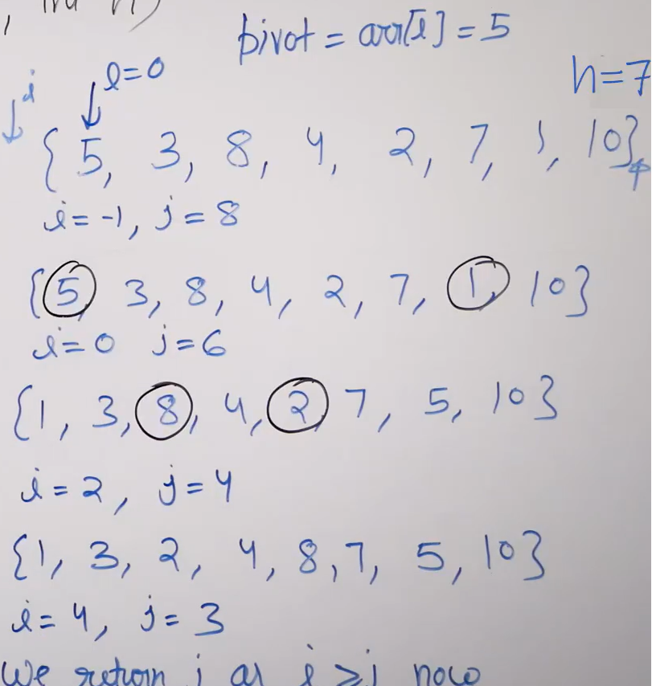

# Quick Sort 
- [Quick Sort](#quick-sort)
  - [Partition of Quick Sort](#partition-of-quick-sort)
  - [Naive Partition](#naive-partition)
  - [Lomuto Partition](#lomuto-partition)
    - [Algorithm](#algorithm)
    - [Code](#code)
    - [Illustration](#illustration)
  - [Hoare Partition](#hoare-partition)
    - [Algorithm](#algorithm-1)
    - [Code](#code-1)
    - [Illustration](#illustration-1)
  - [Quick Sort using Lomuto](#quick-sort-using-lomuto)
    - [Illustration](#illustration-2)
  - [Quick Sort using Hoare](#quick-sort-using-hoare)
    - [Code](#code-2)
    - [Illustration](#illustration-3)
  - [Analysis of the Quick Sort](#analysis-of-the-quick-sort)
    - [Time Complexity](#time-complexity)
    - [Space Complexity](#space-complexity)
  - [**Choice of Pivot**](#choice-of-pivot)
  - [Tail Call Elimination](#tail-call-elimination)

## Partition of Quick Sort

- **Partition:** The goal is to arrange elements in an array such that all elements less than or equal to a given pivot value comes before the pivot and all elements greater appear after the pivot.

## Naive Partition
- Idea is to create a temp array and on one traversal store elements <= pivot and second traversal store elements > pivot. 
- Copy the temp to given array
- This is **Stable**

```python
   '''
    Time: O(N)
    Space: O(N)
   '''
   def naive_partition(self, arr, l, h, p):
        temp = []
        index = 0
        for i in range(l, h+1):
            if arr[i] <= arr[p]:
                temp.append(arr[i])
        
        for i in range(l, h+1):
            if arr[i] > arr[p]:
                temp.append(arr[i])
                
        for i in range(l, h+1):
            arr[i] = temp[i-l]
```

## Lomuto Partition 
- This is **unstable**
### Algorithm
- We solve the problems asuming the pivot as always the last element
   - We mantian two virtual windows for pivot left and right elements
   - If element is <= pivot we extend the legt window by swaping it to the next postion of left window end, else move forward
   - Finally, swap the pivot to next postion of left window end
- If **pivot is not the last element**, we simply swap it with the last element.

### Code 
```python
   '''
   Time: O(N)
   Sopace: 1
   '''
   def lamuto_partition(arr, l, h):
        pivot = arr[h]
        i = l - 1
        for j in range(l, h):
            if arr[j] < pivot:
                i += 1
                arr[i], arr[j] = arr[j], arr[i]
        arr[i+1], arr[h] = arr[h], arr[i+1]
        return i+1

```
### Illustration


## Hoare Partition 
- The goal is to assume the pivot as the first element and finally return index j such that [l,j] are < intial pivot and [j+1,h] are >= intial pivot.
- This wont place the intial pivot at its right position
- But, this takes less swaps on average and works better than lomuto on average
- This is also **Unstable**
### Algorithm 
- The algorithm uses two indices, one starting at the beginning of the array (i) and the other starting at the end of the array (j).
-  It then moves the indices towards each other until they meet at an element that is on the wrong side of the partition. 
   - i.e. if **arr[i]> pivot and arr[j]< pivot** then swap them
-  The algorithm then swaps the elements and continues until the indices meet or cross, at which point it returns the index of the partition **(j)**.

### Code 
```python
   '''
    Time: O(N)
    Space: 1
   '''
def hoare_partition(arr, l, h):
    pivot = arr[l]
    i = l - 1
    j = h + 1
    while True:
        i += 1   # do while
        while arr[i] < pivot:
            i += 1

        j -= 1   # do while
        while arr[j] > pivot:
            j -= 1

        if i >= j:
            return j
        arr[i], arr[j] = arr[j], arr[i]

```
### Illustration 



## Quick Sort using Lomuto
- Partiton the array and get the partitioned index using lomuto
- Sort the left part of partition and right part of partition recursively.

```python
   def quick_sort(arr,l,h):
        if l >= h: return

        p = lomuto_partition(arr,l,h)
        quick_sort(arr,l,p-1)
        quick_sort(arr,p+1,h)

```
### Illustration 


## Quick Sort using Hoare
- Partiton the array and get the partitioned index using lomuto
- Sort the left part of partition and right part of partition recursively.
### Code
```python
   def quick_sort(arr,l,h):
        if l >= h: return

        p = hoare_partition(arr,l,h)
        quick_sort(arr,l,p)
        quick_sort(arr,p+1,h)

```
### Illustration 


## Analysis of the Quick Sort
### Time Complexity 


**Best Case**: `O(NlogN)`
- Happens when array is partiotioned into two halfs at each step. The tree would look like a binary tree
- At each level the work is O(n) and the height of the tree is logN (base 2)
- Total work will be O(NlogN)

**Worst Case**: `O(N^2)`

- Happens when array is almost sorted (or sorted) so that partition is done leanving n-1 elements in one half and one at other half.
- The height of the tree goes to N and work done at each level is N.

**Average Case**: `O(NlogN)`

- Assuming a fair possible case and find upper bound to it.
- Here assumed partioned in 1:10 ratio 
- The tree would expand at right in depth, so assume left is also expanded, the height of the tree would be logN (base 10/9). 

### Space Complexity
**Worst Case**: `O(N)`
- The alogirthm is inplace (wont create temp array for storing input elements), but uses extra space for recursive stack.
- The height of recursive stack(tree) will be N (refer time complexity) and at each level constant space is taken.
- so, overall N*1 = O(N)

**Best/Average Case**: `O(logN)`
- In this case, height of recursive stack/tree is logN. so overall is O(logN) space.

## **Choice of Pivot**

- Standard implemetations alwaays choose the pivot randomly so that **expected time complexity would be O(NlogN), space is O(logN)** for any user and input.
- The alogorithm can be changes as to create a random pivot and swap that pivot accoeding to lamuto/hoare.

## Tail Call Elimination 
- We can frther optimize quick sort.
- Quick sort is **tail recurisve** i.e. the last thing happening is a recursive call. Hence, no point in storig the parent call in function stack. At one point, one function call can be stored in function stack.
- In the code, if left part becomes smaller, then we make recursive call for left part. Else for the right part. 
- In worst case (for space), when both parts are of equal sizes in all recursive calls, we use **O(Log n)** extra space. 
  
```python
from typing import List

def quicksort(arr: List[int]) -> List[int]:
    def qsort(l: int, h: int):
        while l < h:
            pivot = hoare_partition(l, h)
            if pivot - l < h - pivot:
                qsort(l, pivot - 1)
                l = pivot + 1
            else:
                qsort(pivot + 1, h)
                h = pivot - 1

```


