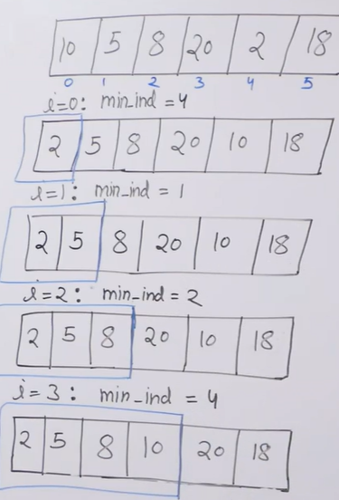
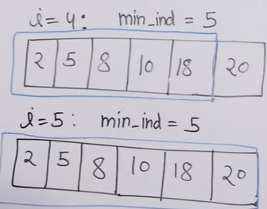
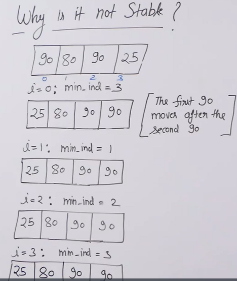

# Selection Sort 
- [Selection Sort](#selection-sort)
  - [Introduction](#introduction)
  - [Algorithm](#algorithm)
  - [Illustration](#illustration)
  - [Code](#code)
  - [Complexity](#complexity)
  - [Stability](#stability)

## Introduction
- Docs less memory Writer compared Quick Sort, Merge,Insertion Sort, etc.
But, Cycle Sort in more optimal for memory writer.
- Basic Idea for Heap Sort
  
## Algorithm 
- Idea is to move first least element to left end and second least element to left end and so on..
- For this, for each index i (upto n-2) we find the minimum element index from i to n-1 and swap them

## Illustration




## Code 
```python
   
   def selection_sort(arr,N):

    for i in range(N-1):
        min_idx = i
        for j in range(i,N):
            if arr[j]<arr[min_idx]:
                min_idx = j 
        arr[i],arr[min_idx] = arr[min_idx],arr[i]

```

## Complexity 
- Time: Theta(N^2), in any case it takes N^2 iterations 
- Space: O(1), inplace sorting

## Stability
- It is not a stable algorithm 
  