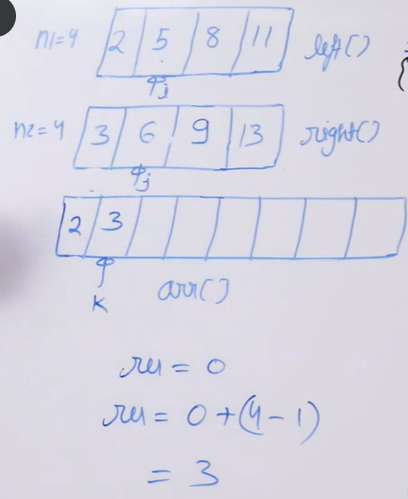

# Count Inversions in Array

- [Count Inversions in Array](#count-inversions-in-array)
  - [Problem Statement](#problem-statement)
  - [Intuition](#intuition)
  - [Algorithm](#algorithm)
  - [Illustration](#illustration)
  - [Code](#code)
## Problem Statement 
**Given an array a[]. The task is to find the inversion count of a[]. Where two elements a[i] and a[j] form an inversion if a[i] > a[j] and i < j.**

Examples: 

Input: arr[] = {8, 4, 2, 1}  
Output: 6  
Explanation: Given array has six inversions: (8, 4), (4, 2), (8, 2), (8, 1), (4, 1), (2, 1).

Input: arr[] = {1, 20, 6, 4, 5}  
Output: 5  
Explanation: Given array has five inversions: (20, 6), (20, 4), (20, 5), (6, 4), (6, 5).

## Intuition 
- Sorting the array can be very useful to solve the problem
- Since this involves comsidering and comparing left and right parts (i<j), merge sort is very similar to the problem
- Find a way to utilize merge sort implementation to our advantage

## Algorithm
- We can modift merger sort algorithm, so that it will also count the inversions comparing left and right parts along with merging the parts.
- Modiy the **Merge Function** to do the above
  - If left[i] > right[j] , res = res+ (count of left[i] to end of left) 
  - we can find one right[j] < left[i] then all other left[i+++] will be greater than right[j]. so we count the remainng elements in left and increment res accordingly.
  - Rest is just the same as merge function

## Illustration 

- Here when 5>3, 3 is smaller than 8,11 as well

## Code 
```python

  '''
  same as merge sort
  Time: O(logN)
  Space: O(N)
  '''
   
class Inversion_Count:

        
    def count_inversion(self,arr,l,r):
        
        res = 0
        mid = (l+r)//2
        
        if l>=r: return res
        
        res += self.count_inversion(arr,l,mid)
        res += self.count_inversion(arr,mid+1,r)
        res += self.count_merge(arr,l,mid,r)
        
        return res
        
    def count_merge(self,arr,l,mid,r):
        
        temp = []
        i ,j = l, mid+1
        res = 0
        while(i<= mid and j<= r):
            if arr[i]<= arr[j]:
                temp.append(arr[i])
                i+=1
            else:
                temp.append(arr[j])
                res+=(mid-i)+1
                j+=1
                
        while i<= mid:
            temp.append(arr[i])
            i+=1
        while j<=r:
            temp.append(arr[j])
            j+=1
            
        for i in range(len(temp)):
            arr[l+i] = temp[i]
            
        return res
            

```