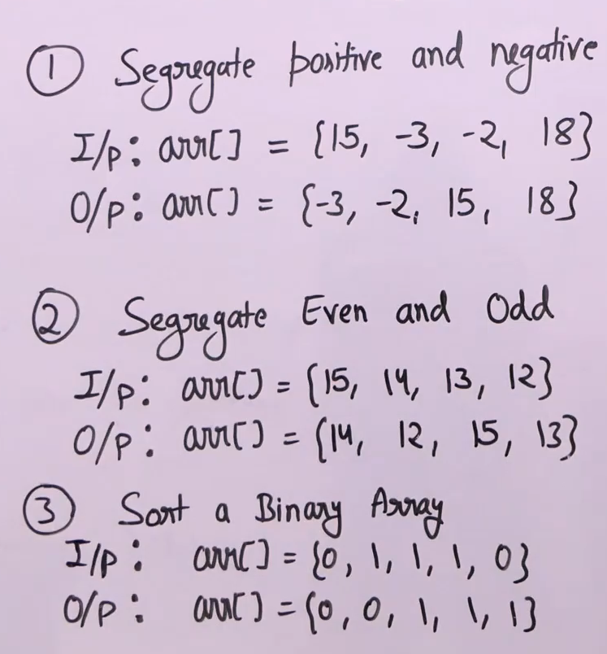

# Segregate two types of elements in array 
- [Segregate two types of elements in array](#segregate-two-types-of-elements-in-array)
  - [Problem Statement](#problem-statement)
  - [Algorithm](#algorithm)
  - [Code for segregating negatives and positives](#code-for-segregating-negatives-and-positives)

## Problem Statement

- Segregate negative leftside and positive rightside
- Segregate odd leftside and even rightside 
- Segregate 0s and 1s 
- Order is not important
- Only one traversal of array is allowed

## Algorithm
- Slightly modify hoarsed or lomuto partition.
- For hoarse, compare i and j th elements based on two types of conditions (arr[i]<0 arr[j]>0).
- No need of choosing a pivot for hoarse modifications.

## Code for segregating negatives and positives
```python
'''
Time: O(N)
Space: 1
'''
  def segregate(arr, n):
    i = -1
    j = n
    while True:
        i += 1
        while arr[i] < 0:
            i += 1
        j -= 1
        while arr[j] >= 0:
            j -= 1

        if i >= j:
            return
        arr[i], arr[j] = arr[j], arr[i]
```