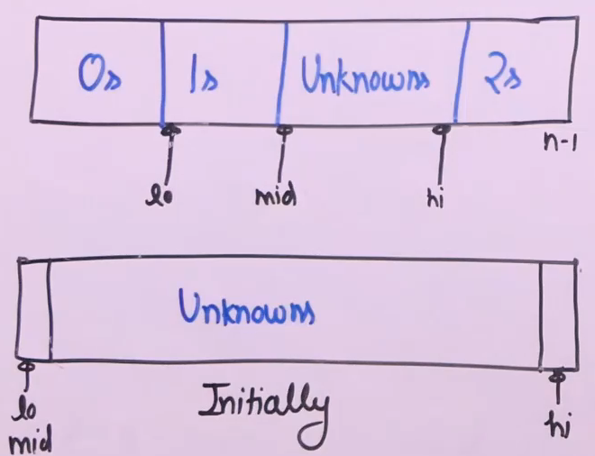
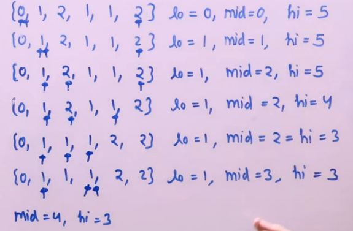

# Sort an array with three types of elements
- [Sort an array with three types of elements](#sort-an-array-with-three-types-of-elements)
  - [Problem Statement](#problem-statement)
  - [Algorithm-**Dutch National Flag Algorithm**](#algorithm-dutch-national-flag-algorithm)
  - [Code](#code)
  - [Illustration](#illustration)

## Problem Statement 
**Given an array A[] consisting 0s, 1s and 2s. The task is to write a function that sorts the given array. The functions should put all 0s first, then all 1s and all 2s in last.**
Examples:   
Input: {0, 1, 2, 0, 1, 2}  
Output: {0, 0, 1, 1, 2, 2}  

Input: {0, 1, 1, 0, 1, 2, 1, 2, 0, 0, 0, 1}  
Output: {0, 0, 0, 0, 0, 1, 1, 1, 1, 1, 2, 2}  

## Algorithm-**Dutch National Flag Algorithm**

- Idea is to have windows where one windows has left elements and one window has right elements and one windoes with unknown elements.
- Process the unkown and put them in right position.
- [0,low) is 0s, [low,mid-1] 1s, [mid,high] unknown, [hig+1,n-1] is 2s.

## Code 
```python
'''
Time: o(N)
Space: 1
'''

def segregate(arr, n):
    l = 0
    h = n - 1
    mid = 0
    while mid <= h:
        if arr[mid] == 0:
            # swapping arr[l] and arr[mid]
            arr[l],arr[mid] = arr[mid], arr[l]
            l += 1
            mid += 1
        elif arr[mid] == 1:
            mid += 1
        else:
            # swapping arr[h] and arr[mid]
            arr[mid],arr[h] = arr[mid], arr[h]
            h -= 1

```

## Illustration 



