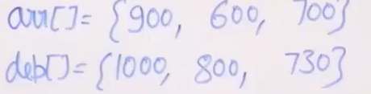
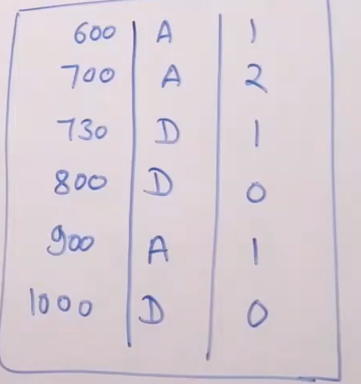

# Meeting the maximum guests
- [Meeting the maximum guests](#meeting-the-maximum-guests)
  - [Problem Statement](#problem-statement)
  - [Algorithm](#algorithm)
  - [Code](#code)

## Problem Statement 
**Consider a big party where a log register for guest's entry and exit times is maintained. Find the max no,of guests present at any time in the log register. Note that entries in register are not in any order.**

Example : 

Input: arrl[] = {1, 2, 9, 5, 5}  
       exit[] = {4, 5, 12, 9, 12}  
First guest in array arrives at 1 and leaves at 4, 
second guest arrives at 2 and leaves at 5, and so on.  
Output: 3  
There are maximum 3 guests at time 5. 

## Algorithm 
- Sort the arrivale and dept times.
- consider them as one sorted array and process them. (**Merge Function**)
 

  
- Next time is arrival, increment guest count, if depaarture decrement guest count.
- Return the max guest count at any time.

## Code 
```python
'''
Time: O(NlogN)
Space: O(N) 
'''
def max_guest(arr, dep, n):
    arr.sort()
    dep.sort()

    i, j, res, curr = 1, 0, 1, 1
    while i < n and j < n:
        if arr[i] < dep[j]:
            curr += 1
            i += 1
        else:
            curr -= 1
            j += 1
        res = max(curr, res)
    return res

```

  