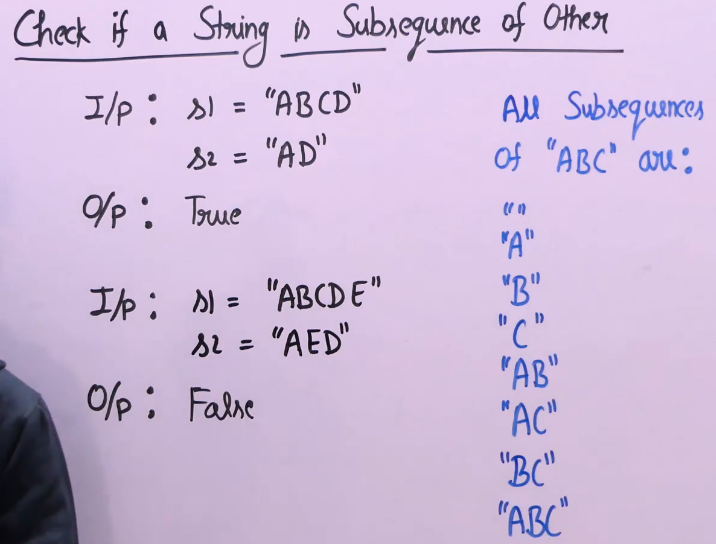

# Check Subsequence
- [Check Subsequence](#check-subsequence)
  - [Problem Statement](#problem-statement)
  - [Algorithm](#algorithm)
  - [Code](#code)

## Problem Statement

Check if given str2 is a subsequence of str1. Subsequence means substrings but not necessarily contiguous

## Algorithm 
- Use two pointer approach one for each string 
- Move the pointer for str2 when current chars are same
- At the end, check if whole str2 is processed then return true else false

## Code 
```python
'''
Time: O(N+M)
Space:1
'''
def isSubSequence(self, B, A):
        n = len(A)
        m = len(B)
        
        i=j=0
        while i<n and j<m:
            if A[i]==B[j]:
                j+=1
            i+=1
        
        return j==m
```