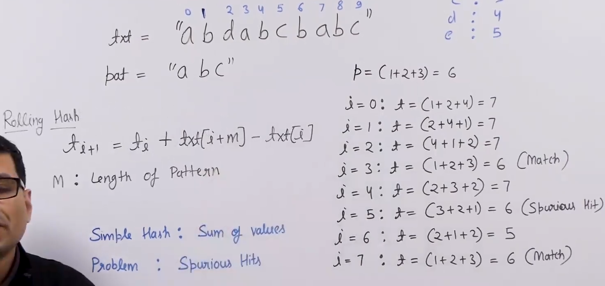
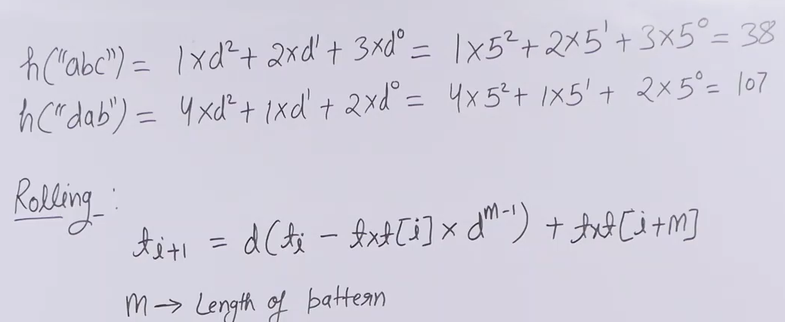

# Pattern Searching 
- [Pattern Searching](#pattern-searching)
  - [Problem Statement](#problem-statement)
  - [Naive Approach](#naive-approach)
    - [Algorithm](#algorithm)
    - [Code](#code)
  - [Efficient Naive Approch if **pattern is distinct**](#efficient-naive-approch-if-pattern-is-distinct)
    - [Idea](#idea)
    - [Code](#code-1)
  - [**Rabin Karp Algorithm**](#rabin-karp-algorithm)
    - [Idea](#idea-1)
    - [Calculating current hash and next sequence harsh](#calculating-current-hash-and-next-sequence-harsh)
    - [Algorithm](#algorithm-1)
    - [Code](#code-2)
    - [Time Complexity](#time-complexity)

## Problem Statement 
Given a text string txt and a pattern string pat, find all the starting indices of the pattern pat in the text txt.

txt = "ABCABCD" 
pat = "ABCD"  
All index numbers where pattern found: 3  

## Naive Approach 
### Algorithm 
- Take the text string txt and the pattern string pat as inputs.
- Initialize variables m and n to the lengths of pat and txt respectively.
- Traverse the text string txt from 0 to (n-m) index.
- For each index i of txt, traverse the pattern string pat and compare the characters of txt and pat.
- If all the characters of pat match with the characters of txt starting from index i, print the index i.
- Repeat steps 4-5 until all the indices of txt have been traversed.
- The indices where the pattern is found are printed.

### Code 
```python
'''
Time: O((N-M+1)*M)
Space: 1
'''
def pat_searching(txt, pat):
    m = len(pat)
    n = len(txt)
    for i in range(n - m + 1):
        for j in range(m):    ## using for else block
            if pat[j] != txt[i+j]:
                break
        else:
            print(i, end=' ')
```

## Efficient Naive Approch if **pattern is distinct** 
### Idea  
- Skip the characters upto which there is match in the pattern, since the elements are distinct they dont match after wards

### Code 
```python
'''
Time: O((N)
Space: 1
'''
def pat_searching(txt, pat):
    m = len(pat)
    n = len(txt)
    for i in range(n - m + 1):
        for j in range(m):
            if pat[j] != txt[i+j]:
                break
        else:
            print(i, end=' ')

        if j==0:
            i+=1
        else:
            i=i+j
```

## **Rabin Karp Algorithm** 
### Idea 

- The algorithm works by computing the hash value of the pattern and the initial substring of the text of the same length as the pattern. 
- If the hash values match, it compares the pattern and the substring character by character to confirm the match. 
- If the hash values don't match, it slides the substring by one character and computes its hash value again until it finds a match or reaches the end of the text.

### Calculating current hash and next sequence harsh


### Algorithm 
- The code defines two constants d and q. d is the number of characters in the input alphabet (256 for ASCII), and q is a prime number used for computing the hash value.
  
- The RBSearch function takes four parameters: the pattern to be searched, the text in which to search, the length of the pattern M, and the length of the text N.
- 
- The function computes h using the formula (d^(M-1))%q. This value is used to remove the first character of the previous substring from the hash value and add the next character.

- The function initializes p and t to the hash value of the pattern and the initial substring of the text of length M.
  
- The function then iterates through all possible substrings of length M in the text and computes their hash values. If the hash value matches the pattern, it compares the substring and the pattern character by character to confirm the match. If the match is confirmed, it prints the starting index of the substring.
  
- The function then slides the substring by one character and computes its hash value again using the formula t=((d*(t-txt.charAt(i)*h))+txt.charAt(i+M))%q. The formula removes the first character of the previous substring from the hash value and adds the next character.
  
- The function repeats steps 5 and 6 until all substrings of length M have been searched.

### Code 
```python
d = 256
q = 101

def RabinKarp(pat, txt):
    M = len(pat)
    N = len(txt)
    h = pow(d, M-1) % q
    p = 0
    t = 0
    res = []
    
    # Compute the hash value of the pattern and the initial substring of the text
    for i in range(M):
        p = (d*p + ord(pat[i])) % q
        t = (d*t + ord(txt[i])) % q
    
    # Iterate through all possible substrings of length M in the text
    for i in range(N-M+1):
        # Check if the hash values match
        if p == t:
            # Compare the pattern and the substring character by character
            flag = True
            for j in range(M):
                if txt[i+j] != pat[j]:
                    flag = False
                    break
            if flag:
                res.append(i)
        # Compute the hash value of the next substring using the previous substring
        if i < N-M:
            t = (d*(t-ord(txt[i])*h) + ord(txt[i+M])) % q
            if t < 0:
                t += q
    
    return res

```
### Time Complexity 
- Overall, the Rabin-Karp algorithm has an average time complexity of O(N+M) 
- worst-case time complexity of O(NM), where N is the length of the text and M is the length of the pattern. 
- However, its worst-case performance is rare in practice due to the use of a prime number q for computing the hash value.